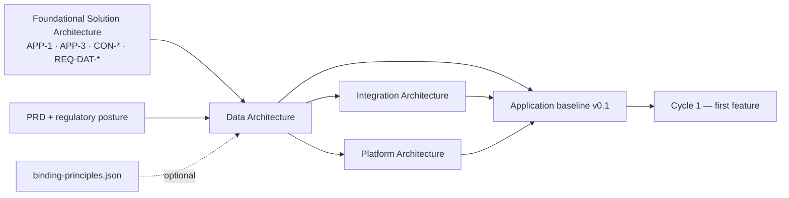

# Data Architecture — Document Template

## 0. How to use this template

The Data Architecture is the **canonical data viewpoint (DAT-\*)** for one product. It answers, once and before any epic is cut, the four questions that every feature cycle would otherwise answer differently by accident: *who owns each entity*, *how is it classified, retained and located*, *what is the shape of an event*, and *which data planes exist*. It is produced at Cycle 0 (Phase 2.25) from the approved Foundational Solution Architecture, is gated by the Enterprise Architect alongside its two sibling viewpoints, and thereafter moves only by a `data-architecture.delta.json` emitted from a feature cycle.

It was previously triggered from the LLD. That made the data model a *consequence* of how someone happened to design their classes — an inverted dependency in a DDD regime. The foundational invocation exists to put the ownership register in front of the code, not behind it.

It owns exactly four things and deliberately nothing else:

1. **Ownership** — DAT-1: exactly one writing context per entity, and the system of record that holds it.
2. **Governance of the data itself** — DAT-3: classification, retention and residency, the three together, because that triple is what `PRIN-06-C1` checks.
3. **The event data standard** — DAT-2: the envelope every domain event carries, and the register of events the architecture already knows about.
4. **Planes, consistency and replication** — DAT-4 to DAT-6: which planes exist, where consistency is strong and where it is eventual, and every read model that copies someone else's attribute.

**The one-line tests for what belongs here.** Apply them to every sentence before it is written:

| Question | If yes… |
| --- | --- |
| Is it a `CREATE TABLE`, a column type, an index, a migration or an ORM class? | It is **never** in this document. That is service HLD/LLD, one phase later. |
| Does it say which bounded context may *write* an entity? | It is **only** in this document (DAT-1). |
| Is it a retention period, a residency region or a staleness budget with no cited source? | It is not a value. It is `PENDING` with a DAT-PEND trigger. |
| Does it choose the compute, the managed service or the cluster that *runs* a store? | It is Platform (PLT-3). State the capability the data needs; the realisation is theirs. |
| Does it name a topic, a contract version or an endpoint path? | It is Integration (INT-3). This document owns the envelope and the business meaning of the payload, not the transport. |
| Does it record what is deployed today, in which version, owned by which squad? | It is baseline payload. Never here — see Appendix A for the brownfield exception. |

**Section-ID spine.** `DAT-1` … `DAT-10`, the conformance checks `DAT-Cn`, and the deferrals `DAT-PEND-nn` are stable identifiers shared with the application baseline and the conformance checker. Headings may be reworded; IDs must never be renumbered or reused.

**Entity and context names are not yours to change.** They match the FSA's APP-1 and APP-3 exactly — never renamed, never renumbered, never invented. A name that differs from the FSA silently breaks every downstream key.

**Template conventions used below.**

- Text in `[square brackets]` is a placeholder the authoring agent replaces.
- Lines beginning *Example:* are illustrative content drawn from the HarvestLink producer/buyer marketplace (Catalogue, Orders, Billing, Identity, Notifications). Delete them in a real document.
- Text diagrams are plain ASCII in fenced `text` blocks — readable in a terminal, a diff and a PR review.
- **A value is either traceable or `PENDING`. There is no third category.** "Six years is typical for financial records" is an invention with a citation-shaped wrapper.
- Mode-specific guidance is marked **[GF]** greenfield, **[BF]** brownfield retrofit, or **[BOTH]**.

## 1. Document control

Every field is required. Version follows semantic versioning where a **major** bump means a normative change (an ownership move, a classification change, a new plane), a **minor** bump means a clarification or a restoration that changes no rule, and a **patch** is editorial.

| Field | Value | Notes |
| --- | --- | --- |
| Document | Data Architecture | Fixed |
| Document id | `dat-[system-slug]` | *Example:* `dat-harvestlink` |
| Canonical path | `/architecture/data-architecture.md` | Same path in every project; agents key on it |
| Project / product | `[name]` | *Example:* HarvestLink Marketplace |
| Version | `[MAJOR.MINOR.PATCH]` | *Example:* `1.0` at Cycle 0 |
| Lifecycle stage | `Cycle 0` / `Cycle [n] delta` | Cycle 0 is the foundational invocation |
| Status | `DRAFT` / `IN REVIEW` / `APPROVED` / `SUPERSEDED` | Only `APPROVED` is normative |
| Mode | `GREENFIELD-CREATE` / `BROWNFIELD-RETROFIT` / `BROWNFIELD-DELTA` | Drives Appendix A |
| Owner | Data Architect | Accountable human role |
| Authoring agent | `[agent id @ version]` | *Example:* `L1-design-data-architect@1.0.0` |
| Parent document | `foundational-solution-architecture.md @ [version]` | The exact version read |
| Approval gate | Enterprise Architect (with Platform Lead at Cycle 0 exit) | Recorded in the version history |
| Regulatory regimes in scope | `[list]` | Copied from the PRD's Regulatory Posture. *Example:* UK GDPR; HMRC/Companies Act business-record retention; food-safety registration validity |
| Downstream consumers | integration-architect · platform-architect · arch-baseline-generator · env-provisioner · synthetic-data-generator · gr-L1-architecture-conformance | Change the section spine and each of these breaks |

### 1.1 Version history

| Version | Date | Change type | Summary | Delta / ADR | Approver |
| --- | --- | --- | --- | --- | --- |
| `[1.0]` | `[date]` | Created | Initial Cycle 0 `[product]` Data Architecture | — | `[EA name]` |
| *Example:* 1.1 | 2026-05-02 | Normative (minor) | DAT-PEND-02 fired: Order retention resolved to 6 years from ES3 | `data-architecture.delta.json` c3 | J. Okafor |

---

## 2. Purpose and Scope

### 2.1 Purpose statement

`[One paragraph, written for the Enterprise Architect, stating what this document decides for this product and why those decisions cannot wait for a feature cycle. Readable without the PRD.]`

*Example:* This document fixes data ownership, classification and plane decisions for HarvestLink before the first epic is cut. Five bounded contexts write to a shared persistence platform; without a single authoritative owner per entity, the first cycle that needs a producer's registration status inside Catalogue will write one, and the second will write another. Ownership decided here costs an afternoon; ownership discovered later costs a migration.

### 2.2 What this document owns

| Section IDs | Owns | Downstream reader |
| --- | --- | --- |
| DAT-1 | Entity ownership and system-of-record rules | integration-architect, platform-architect, LLD agents, synthetic-data-generator |
| DAT-2 | Canonical event envelope and event register | integration-architect (INT-3 naming, kinds and versioning build on this) |
| DAT-3 | Classification, retention, residency, encryption *requirement* | platform-architect (PLT-10 realisation), security review, env-provisioner |
| DAT-4 | Operational, object and analytical planes; lineage | platform-architect (PLT-3, PLT-5), impact-assessor |
| DAT-5 / DAT-6 | Consistency boundaries; read model and replication register | integration-architect, test scenario writers |
| DAT-7 | Traceability from REQ-DAT-\*, CON-\* and principles to the answer | gr-L1-architecture-conformance |
| DAT-8 / DAT-9 | Pending decisions with triggers; evaluable conformance checks | impact-assessor (fires triggers), conformance checker |

### 2.3 What this document must never contain

- Physical schema of any kind: `CREATE TABLE`, column types, indexes, constraints, migrations, ORM classes, SQL.
- Runtime topology, instance sizing, backup jobs, cluster configuration — that is PLT-3 and PLT-14.
- Topic names, contract versions, endpoint paths, retry policy — that is INT-3 and INT-6.
- Team names, service names or database names as *owners*. Ownership is assigned to a bounded context, never to a team, a service or a store.
- A retention period, residency region or staleness budget that no cited source supports.
- Deployed versions, owning squads, CMDB identifiers — baseline payload.

### 2.4 Position in the lifecycle



Data runs first among the three viewpoints because Integration needs the ownership register to know who may publish what, and Platform needs the classification register to know what must be encrypted and isolated. **[BF]** In brownfield this document is normally *read*, not written; it is authored when a running system has no canonical data viewpoint (retrofit) or when a delta moves it.

---

## 3. Inputs and provenance

Every decision below must trace to an input listed here, at the version actually read this run. List only what was read — an input table naming a document the agent never opened is worse than no table.

### 3.1 Product inputs [BOTH]

| Input | Artifact and version read | What was taken from it | Mandatory |
| --- | --- | --- | --- |
| Product requirements | `prd.md @ [version]` | Data-bearing functional scope; the nouns of the domain | Yes |
| Regulatory posture | `prd.md § Regulatory Posture` / `vision.md @ [version]` | Regimes in scope — without these, classification is guesswork wearing a table | Yes |
| NFR classification | `nfr_classifications.json @ [version]` | Per-requirement retention, availability and classification constraints | Where produced |

### 3.2 Architecture inputs [BOTH]

| Input | Artifact and version read | What was taken from it | Mandatory |
| --- | --- | --- | --- |
| Foundational architecture | `foundational-solution-architecture.md @ [version]` | APP-1 contexts; **APP-3 aggregates, entities and invariants**; every CON-\* binding DAT; every REQ-DAT-\*; SEC-\* controls touching data; § 4 PRIN rows | Yes — **blocking** |
| Binding principles resolution | `binding-principles.json @ [version]` | Applicability, binding level, resolved scope, `program_guardrail`, `conformance_checks`, and the `fsa_hooks` whose `binds_viewpoints` contains `DAT` | Optional — see 3.3 |

**Blocking input rule.** An FSA with no APP-3 aggregate model is `INSUFFICIENT_CONTEXT`, not a document to be written around: without an entity set there is nothing to assign ownership over, and ownership is this document's whole reason to exist. Derive nothing.

### 3.3 Knowledge bases consulted [BOTH]

| Knowledge base | Layer | Attached | What this document takes from it |
| --- | --- | --- | --- |
| `kb-L1-enterprise-architecture` | L1 enterprise | Yes | EA2/EA3 estate and integration boundaries (which legacy stores may be read, which must never be written back); EA4 "new services own their datastore, no shared database"; EA10 governance triggers; BP0–BP14 binding-principle catalogue and the BP11 resolution-file contract |
| `kb-L1-enterprise-security` | L1 enterprise | Yes | ES2 classification classes; ES3 retention and erasure; ES9 residency (an approved operating region, never a cloud region id); ES10 encryption, key management and attributable access |
| `kb-L1-nfr-classification-taxonomy` | L1 enterprise | Indirect | Read through `nfr_classifications.json`; the taxonomy the retention and availability classes came from |
| `kb-L2-domain-regulatory` / `kb-L1-regulatory-frameworks-index` | L2 domain / L1 index | Indirect | Read through the PRD's regulatory posture; the source of any retention obligation cited in DAT-3.2 |
| `kb-L2-[domain]` | L2 domain — **swappable** | Where deployed | Domain meaning of an entity: which records are *evidence* rather than application state, and therefore append-only |
| `kb-L3-[project]-application-baseline` | L3 project | **[BF]** only | The as-built entity set and de facto writers — evidence for Appendix A, never transcribed as intent |

**BP11 resolution rule.** When `binding-principles.json` is present, validate it *before* use against its own `validation_rules` (status `APPROVED`; today within `valid_until`; 5–15 principles; every principle has at least one non-placeholder conformance check; every `APPLIES`/`PARTIAL` principle has at least one hook; every `catalogue.abstraction_check == PASS`; every `TRANSITIONAL` exception has `due`, `exit_plan` and `remediation_owner`). A file that fails validation is **unusable input** — which is not the same as the product being non-conformant. Say which, and fall back. When the file is absent, fall back to the FSA § 4 PRIN rows and **record here that you did so**. Do not apply the whole catalogue as if every principle were MANDATORY; do not skip § 4 as if none were.

### 3.4 Demand coverage pre-check

Every REQ-DAT-\* and every CON-\* whose binding viewpoints include DAT is listed here on intake, so an unanswered demand is visible before DAT-7 is written rather than after.

| Demand / constraint | Source | Budget or rule stated in the FSA | Answered in |
| --- | --- | --- | --- |
| `[REQ-DAT-01]` | `[FSA § REQ-DAT]` | `[budget]` | `[DAT-n.n]` |
| *Example:* REQ-DAT-03 | FSA § REQ-DAT | Fee records immutable and retrievable for 10 years | DAT-3.2, DAT-9 (DAT-C3) |
| *Example:* CON-2 | FSA § CON | No context reads another context's store directly | DAT-1.b, DAT-9 (DAT-C1) |

---

## 4. Principles Applied

One subsection per principle that binds DAT. State what the principle requires **of this product**, quoting the `program_guardrail` where the resolution supplies one — a principle restated in catalogue language has not been applied to anything.

| ID | Principle | Applicability | Binding level | Where it lands | Source |
| --- | --- | --- | --- | --- | --- |
| `[PRIN-nn]` | `[name]` | APPLIES / PARTIAL / NOT_APPLICABLE | MANDATORY / DIRECTIONAL / ADVISORY | `[DAT section ids]` | `binding-principles.json` / FSA § 4 |
| *Example:* PRIN-02 | One accountable owner and one authoritative source per data domain | APPLIES | MANDATORY | DAT-1.1, DAT-1.2, DAT-6 | binding-principles.json |
| *Example:* PRIN-06 | Security and privacy are designed in | APPLIES | MANDATORY | DAT-3.2, DAT-3.3, DAT-4.4 | binding-principles.json |
| *Example:* PRIN-03 | Integrate through governed, reusable interfaces | PARTIAL — the data-access half | MANDATORY | DAT-1.b, DAT-6 | binding-principles.json |
| *Example:* PRIN-01 | Business outcome before technology choice | APPLIES | DIRECTIONAL | DAT-4.3, DAT-8 — every deferral carries a trigger (PRIN-01-C1) | FSA § 4 |
| *Example:* PRIN-07 | Prefer strategically approved platforms and managed services | APPLIES | MANDATORY | DAT-4.1 — the store technology named here is checked against the approved catalogue and its lifecycle status | binding-principles.json |

### 4.[n] PRIN-[nn] — `[name]`

`[What this principle requires of this product, in this product's vocabulary. Quote the program_guardrail. Name the conformance check id it contributes — e.g. PRIN-02-C1 — and the DAT-Cn that carries it in DAT-9.]`

*Example — PRIN-02:* Every entity in the HarvestLink domain model has exactly one writing context. Guardrail: *"No HarvestLink component writes an entity owned by another bounded context; a second writer is a boundary defect in APP-1, not a data-access convenience."* Contributes `PRIN-02-C1` (BLOCKING), carried here as DAT-C1.

### 4.[n+1] Declared deviations and standing exceptions

A deviation from a **DIRECTIONAL** principle is a `DEV-xx` row here. A deviation from a **MANDATORY** principle is not a DEV row at all — it needs an approved `EXC-xx` in the resolution file, and this table only references it. Exceptions already approved in `binding-principles.json` are recorded as known drift: never re-litigated, never silently "fixed".

| ID | Principle | Where | Why | Compensating control | Review trigger / exit |
| --- | --- | --- | --- | --- | --- |
| `[DEV-01 / EXC-…]` | `[PRIN-nn]` | `[DAT section]` | `[reason]` | `[control]` | `[condition or exit date]` |
| *Example:* EXC-PRIN-02-001 (TRANSITIONAL) | PRIN-02 | DAT-6 | Legacy wholesale reporting reads Producer directly during pilot | Read-only grant; quarterly review; no write path | Exit 2026-12-31, owner Core IT |

---

# DAT-1 — Domain Entity and System-of-Record Architecture

## DAT-1.1 Bounded Context Ownership

One row per entity in the FSA's APP-3 aggregate model. **Every entity, exactly once.** Cross-check both directions before publishing: every APP-3 entity has a row here, and every row names a context that exists in APP-1. A context that owns no core domain entity is named explicitly below the table — a context missing from this section reads as an omission, not as a decision.

| Entity | Owning Context | Authoritative System of Record | Classification |
| --- | --- | --- | --- |
| `[Entity]` | `[APP-1 context name]` | `[owning context's persistence]` | `[DAT-3.1 class]` |
| *Example:* Listing | Catalogue | Catalogue persistence | Internal |
| *Example:* Order | Orders | Orders persistence | Confidential |
| *Example:* Fee | Billing | Billing persistence | Financial / Regulated Evidence |
| *Example:* Producer | Identity | Identity persistence | PII |

*Example:* Notifications owns no core domain entities — it is stateless and consumes events.

**Where two contexts both appear to need write access**, that is a boundary problem in APP-1, not a data problem to be solved by allowing two writers. Record it as an open question against the FSA and assign the entity to the context whose invariant it protects.

## DAT-1.2 System-of-Record Rules

### DAT-1.a — Exactly One Writer

`[The rule, then a worked example listing two or three real entities and their owners, then the specific cross-context case this forbids for this product.]`

```text
[Entity]
    Owner: [Context]

[Entity]
    Owner: [Context]
```

*Example:* Orders may reference a Listing but may not become a second writer of Listing. A stock decrement at order time is a Catalogue operation invoked through a contract, not an Orders write.

### DAT-1.b — No Cross-Context Direct Database Access

`[The prohibited shape and the permitted shape, both as ASCII text diagrams.]`

```text
PROHIBITED
  [Context A] ──► [Context B store]        direct read or write

PERMITTED
  [Context A] ──► [contract owned by B] ──► [Context B] ──► [Context B store]
```

This is the data half of `PRIN-03-C2` (BLOCKING). The platform enforces it at the credential boundary (PLT-3 Access Boundary); this document states the rule the platform enforces.

## DAT-1.3 Logical Domain Relationships

`[A text diagram of business relationships between entities.]`

```text
[Entity A] ──has──► [Entity B]
[Entity C] ──references──► [Entity A]
```

These describe **business meaning only**. They do not imply foreign keys, and a relationship that crosses a bounded-context boundary never implies one.

## DAT-1.4 Cross-Context Reference Policy

A non-owning context may normally retain:

```text
entity identifier
```

*Example:* `OrderLine.listing_id` — Orders retains the identifier; Catalogue remains the owner of Listing.

Any attribute beyond the identifier is a **replication**, and a replication requires a registered read model in DAT-6 with a named staleness budget. An unregistered copied attribute is the failure mode `PRIN-02-C2` exists to catch.

---

# DAT-2 — Event Data Architecture

## DAT-2.1 Canonical Event Envelope

All domain events carry a standard envelope, independent of the business payload.

```json
{
  "event_id": "uuid",
  "event_type": "[context].[entity].[event]",
  "event_version": "1.0.0",
  "occurred_at": "ISO-8601 timestamp",
  "producer_context": "[APP-1 context]",
  "correlation_id": "uuid",
  "payload": {}
}
```

`[State any additional envelope field this product requires, and why — e.g. a deduplication key derived from the business act for evidence-style events, or a buyer-side correlation identifier that must be carried end to end.]`

The envelope is this document's. **Topic naming, event kinds, versioning rules and delivery semantics are Integration's** (INT-3). Stating the envelope here and the taxonomy there is deliberate: the shape of the record is data, the routing of it is integration.

## DAT-2.2 Initial Event Register

Events the architecture already knows about at Cycle 0.

| Event | Owner | Purpose | Version |
| --- | --- | --- | --- |
| `[context].[entity].[event]` | `[context]` | `[why it exists]` | `Planned` / `Active` |
| *Example:* `catalogue.listing.published` | Catalogue | Listing lifecycle notification | Planned |
| *Example:* `orders.order.placed` | Orders | Inform downstream financial processing | Planned |
| *Example:* `billing.payout.scheduled` | Billing | Inform notification capability | Planned |

`Planned` means the architecture recognises the event; it becomes `Active` only when the feature that produces it lands.

## DAT-2.3 Event Ownership

The producing context owns the business meaning of its event. A consumer does not become an owner of the entity.

*Example:* `orders.order.placed` is owned by Orders. Billing consumes it and does not thereby become an owner of Order.

---

# DAT-3 — Classification, Retention and Residency

## DAT-3.1 Classification Model

The classes this product uses, taken from `kb-L1-enterprise-security` ES2 and extended only where the product genuinely needs a class the standard does not name.

| Classification | Meaning |
| --- | --- |
| `[class]` | `[meaning]` |
| *Example:* Public | Safe for public disclosure |
| *Example:* Internal | Internal operational information |
| *Example:* Confidential | Sensitive to a specific party |
| *Example:* PII | Personally identifiable information |
| *Example:* Financial | Financially sensitive information |
| *Example:* Regulated Evidence | Must be preserved, append-only, for audit or dispute |

## DAT-3.2 Data Classification Register

**The same entity set as DAT-1.1, in the same order.** Resolve classification from ES2, retention from ES3 and the regulatory posture, residency from ES9.

| Entity | Classification | Retention | Residency |
| --- | --- | --- | --- |
| `[Entity]` | `[class]` | `[period + source]` / `PENDING` | `[approved operating region]` / `PENDING` |
| *Example:* Fee | Financial / Regulated Evidence | 10 years (regulatory posture — tax audit) | Approved financial-data region |
| *Example:* Producer | PII | UK GDPR policy; erasure honoured for the population not held under the compliance-retention obligation (ES3) | Approved PII region |
| *Example:* Order | Confidential | `PENDING` — DAT-PEND-02 | Approved operating region |

**Rules that make this table trustworthy:**

- Residency is an **approved operating region** — a policy name (ES9). Never a datacentre, availability zone or cloud region id; that is PLT's realisation.
- Backups, DR copies, log exports and analytical replicas **inherit** the residency of the source entity. A copy is not a new decision, and a residency rule that the backup breaks was never in force.
- A value the cited standards answer is grounded and MUST be stated. A value they do not answer is `PENDING` with a matching DAT-PEND row and a trigger. Never a plausible period; never a default region.
- Every entity classified PII, Financial, Confidential or Regulated Evidence needs **all three** cells resolved or explicitly pending — that triple is what `PRIN-06-C1` (BLOCKING) evaluates.

## DAT-3.3 Encryption Requirement

`[State the requirement for the protected classes, per ES10.]`

```text
encryption at rest
encryption in transit
keys held in the group managed key capability — never application-held, never committed
key rotation without redeploying unrelated consumers
access attributable to a named principal — a shared service account fails attribution
```

**The boundary:** this document states the *requirement* and the classes it applies to. The Platform Architecture (PLT-10) determines the technical realisation. Naming a key-management product here is a scope error.

---

# DAT-4 — Data Planes and Lineage

## DAT-4.1 Operational Data Plane

**Decision:** `[REQUIRED | NOT PRESENT]`

`[Purpose, and the technology chosen. This document MAY name a technology — the FSA may not. State the PRIN-07 check outcome explicitly: is the product in the approved catalogue, and is its lifecycle status outside contain/retire?]`

*Example:* PRIN-07 check — managed relational capability, approved catalogue entry, lifecycle status `invest`. Passes `PRIN-07-C1`.

**Ownership model.** Each context maps to its own schema:

```text
[Context] ──► [context schema]
[Context] ──► [context schema]
```

A schema is platform infrastructure. **Provisioning a schema does not transfer domain ownership** — ownership is DAT-1.1, and nothing else changes it.

## DAT-4.2 Object Data

`[Which binaries are not stored as relational blobs, and what holds the business metadata and reference. Omit this subsection entirely if the product has no object data.]`

```text
[Context]
   ├── metadata + reference ──► [context schema]
   └── binary               ──► [object capability]
```

## DAT-4.3 Analytical Plane

**Status:** `[REQUIRED | PENDING | NOT PRESENT]`

`[If not required at Cycle 0, say so plainly — a plane is not created because it may eventually be useful — then give the decision trigger as a numbered list of conditions, any one of which reopens the decision.]`

*Example decision trigger:*

1. A requirement needs cross-context aggregate reporting that no single context can answer.
2. Reporting query load begins to affect a transactional latency budget.
3. An outbound enterprise reporting feed is committed (EA3 — one-way, aggregate, non-PII).

A deferral with no trigger is a silence, and `PRIN-01-C1` fails it.

## DAT-4.4 Lineage

For every flow that crosses a plane boundary or a context boundary:

| Flow | Source owner | Destination | What may cross | What may not | Residency constraint |
| --- | --- | --- | --- | --- | --- |
| `[flow]` | `[context]` | `[plane / context]` | `[fields or classes]` | `[fields or classes]` | `[the ES9 rule that applies]` |
| *Example:* Aggregate metrics → enterprise DW | All contexts | Group data warehouse | Aggregate, non-PII counts | Any PII field; any Financial record | Financial records must not be replicated outside the approved financial-data region without an approved exception |

---

# DAT-5 — Consistency Model

## Inside One Context

`[What may use strong transactional consistency, with a worked example showing one transaction boundary.]`

```text
BEGIN
  [write entity A]
  [write entity B]        both owned by the same context
COMMIT
```

## Across Contexts

Distributed database transactions are **not** the default integration mechanism for this product.

`[A worked example showing where eventual consistency results, and which context becomes eventually consistent with which — named explicitly, because "eventually consistent" without a direction is not a decision.]`

*Example:* `orders.order.placed` is published by Orders and consumed by Billing. Billing's view of a given order is eventually consistent with Orders'. The window is the staleness budget in DAT-6; the reliability of the propagation is INT-6.

---

# DAT-6 — Read Models and Replication Register

| Read Model | Source Owner | Consumer | Staleness Budget | Status |
| --- | --- | --- | --- | --- |
| `[name]` | `[owning context]` | `[consuming context]` | `[budget + source]` / `PENDING` | `Planned` / `Active` |

*Example:* `None at Cycle 0.`

`None at Cycle 0` is a valid and common content. Follow the table with the standing rule: **any future replicated attribute must be entered here, with a staleness budget, before it is used.** A copied attribute that is not in this register is exactly the drift `PRIN-02-C2` reports.

---

# DAT-7 — Data Architecture Demand Traceability

One row per REQ-DAT-\*, per CON-\* binding DAT, and per principle applied. Every one. An unanswered demand becomes an open question, never an omitted row.

| FSA Demand / Principle | Data Architecture Satisfaction |
| --- | --- |
| `[REQ-DAT-nn / CON-n / PRIN-nn]` | `[DAT section id + one line saying how]` |
| *Example:* REQ-DAT-03 (fee immutability, 10 yr) | DAT-3.2 classifies Fee as Financial / Regulated Evidence with 10-year retention; DAT-C3 checks the triple |
| *Example:* CON-2 (no cross-context store access) | DAT-1.b states the rule; DAT-C1 and PLT-3 Access Boundary enforce it |

---

# DAT-8 — Pending Decisions

| ID | Decision | Status | Trigger |
| --- | --- | --- | --- |
| `DAT-PEND-nn` | `[what is not yet decided]` | `PENDING` | `[the condition that reopens it]` |
| *Example:* DAT-PEND-01 | Analytical plane realisation | PENDING | Any DAT-4.3 trigger condition fires |
| *Example:* DAT-PEND-02 | Order retention period | PENDING | Regulatory posture supplies a retention obligation for transactional order records |

**A trigger is a condition, never a date.** "Revisit in Q3" is a calendar entry; "when a requirement needs cross-context aggregate reporting" is a trigger the impact assessor can evaluate mechanically.

Every `PENDING` anywhere in this document has a row here, and every row here is referenced from the section that defers it.

---

# DAT-9 — Conformance Checks

One subsection per check, each expressed so a checker can evaluate it — not as prose. Cover at minimum: one writer per entity; no unregistered replication; protected data has classification **and** retention **and** residency.

### DAT-C1 — One Writer Per Entity

```text
for each entity in DAT-1.1:
    count(writing_contexts) == 1
severity: BLOCKING            source: PRIN-02-C1
```

### DAT-C2 — No Unregistered Replication

```text
for each attribute held by a context that does not own its entity:
    attribute == entity_identifier
    or exists read_model in DAT-6 with staleness_budget
severity: MAJOR               source: PRIN-02-C2
```

### DAT-C3 — Protected Data Has Governance

```text
for each entity in DAT-3.2 where classification in
        [PII, Financial, Confidential, Regulated Evidence]:
    exists classification and exists retention and exists residency
    or exists DAT-PEND row with trigger
severity: BLOCKING            source: PRIN-06-C1
```

### DAT-C[n] — `[additional check this product needs]`

```text
[evaluable expression]
severity: [BLOCKING | MAJOR | MINOR]    source: [principle check id]
```

---

# DAT-10 — Change Model

Feature cycles do **not** rewrite this document. They emit a delta:

```json
{
  "target_document": "data-architecture.md",
  "from_version": "1.0",
  "changes": [
    {
      "type": "add_entity | change_classification | register_read_model | resolve_pending",
      "section": "DAT-1.1",
      "content": "[the change]"
    }
  ],
  "version_bump": "minor | major",
  "structural": false,
  "adr_required": false
}
```

The transition: a delta is merged only after the feature that motivated it is merged and verified. The merge raises the version per the rule in § 1, appends a version-history row, and re-runs DAT-9. A `structural: true` delta — an ownership move, a new plane, a classification downgrade — requires an ADR and the Enterprise Architect gate before merge.

---

## Version History

| Version | Change |
| --- | --- |
| 1.0 | Initial Cycle 0 `[product]` Data Architecture |

---

## Appendix A — Brownfield reconciliation [BF]

Present only in `BROWNFIELD-RETROFIT`, or where a delta reconciles known drift. The baseline tells you where the data *is*; it must never be transcribed as where it *should be*.

### A.1 Recovery method

`[What was read — application-baseline.md, data-model-overview.md, live schema, grant tables — and at what commit or export date.]`

### A.2 Divergence register

| DAT section | Target says | Baseline shows | Classification | Resolution |
| --- | --- | --- | --- | --- |
| `[DAT-1.1]` | `[intended owner]` | `[actual writers]` | Drift / Accepted exception / Target error | `[remediation or EXC id]` |
| *Example:* DAT-1.1 Producer | Identity is sole writer | Two services write `producer` | Drift — BLOCKING (PRIN-02-C1) | Remediation epic; no exception is available for a MANDATORY principle |

### A.3 Legacy decisions adopted into the target

`[Decisions the target deliberately keeps, with the reason. A decision adopted without a reason is drift that has been renamed.]`

### A.4 Known violations not to be encoded as intent

`[From binding-principles.json brownfield.principle_posture. These stay visible as violations; a retrofit that writes them into DAT-1 has laundered them.]`

---

## Appendix B — Authoring agent self-check and quality gate

### B.1 Content boundary — BLOCKING

- [ ] No `CREATE TABLE`, column type, index, migration, ORM class or SQL anywhere in the document.
- [ ] No runtime, sizing, backup or cluster configuration (that is PLT).
- [ ] No topic name, contract version, endpoint path or retry policy (that is INT).
- [ ] Ownership is assigned to bounded contexts only — never a team, a service name or a database.

### B.2 Completeness — BLOCKING

- [ ] Every APP-3 entity appears exactly once in DAT-1.1; no entity has two owning contexts.
- [ ] Every DAT-1.1 row names a context that exists in APP-1; every APP-1 context is accounted for, including those owning nothing.
- [ ] DAT-3.2 covers the same entity set as DAT-1.1, in the same order.
- [ ] Every PII / Financial / Confidential / Regulated-Evidence row has classification **and** retention **and** residency, or a `PENDING` with a DAT-PEND trigger.
- [ ] Every REQ-DAT-\* and every DAT-binding CON-\* has a DAT-7 row.
- [ ] Every `PENDING` has a trigger; every DAT-PEND row is referenced from the section that defers it.
- [ ] DAT-9 contains at least DAT-C1, DAT-C2 and DAT-C3, each as an evaluable expression.

### B.3 Grounding — BLOCKING

- [ ] No retention period, residency region or staleness budget appears that no cited source supports.
- [ ] Every classification traces to ES2, every retention to ES3 or the regulatory posture, every residency to ES9.
- [ ] Any technology named in DAT-4 has its PRIN-07 lifecycle check stated, with the outcome.
- [ ] If `binding-principles.json` was absent or failed validation, § 4 says so and names the fallback source — and distinguishes *unusable input* from *non-conformant product*.

### B.4 Quality — review findings

- [ ] Ownership decisions that were not obvious carry a stated reason (which invariant the entity protects).
- [ ] The analytical plane is not created speculatively, and its deferral has real trigger conditions.
- [ ] Text diagrams are plain ASCII in fenced `text` blocks.
- [ ] Guardrails evaluated and recorded: `gr-L1-schema-validator`, `gr-L1-pii-detection`; downstream `gr-L1-architecture-conformance`.

### B.5 Anti-patterns the reviewer looks for

| Anti-pattern | Why it fails |
| --- | --- |
| Two writers "for now" | The BLOCKING failure this document exists to prevent; it is never removed later |
| A plausible retention period | An invention with a citation-shaped wrapper; `PENDING` is the honest answer |
| Residency stated as a cloud region id | Confuses the policy with its realisation (ES9); the platform picks the region, not the data architect |
| Ownership assigned to a service or a team | Services get renamed and teams get reorganised; bounded contexts are the stable unit |
| An analytical plane "because we will want reporting" | A plane created before a requirement is a platform nobody owns |
| A read model appearing in a feature cycle with no DAT-6 row | Unregistered replication — invisible staleness, and drift by construction |
