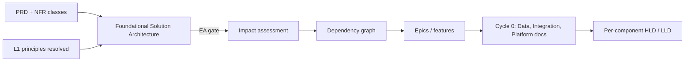
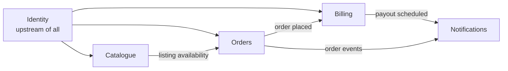
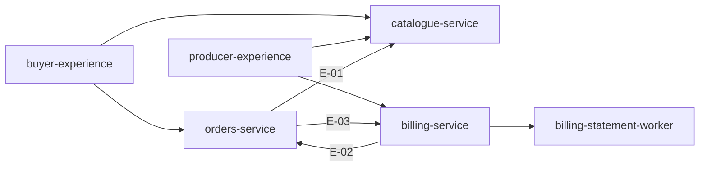
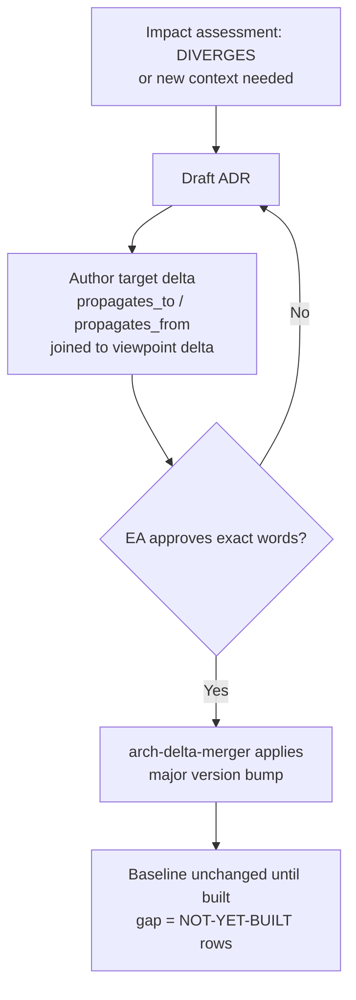

# Foundational Solution Architecture — Document Template


## 0. How to use this template

The Foundational Solution Architecture (FSA) is the **target architecture**: a normative statement of how the system is decomposed, the rules that bind every other viewpoint, and the demands that decomposition places on Data, Integration and Platform. It is produced once (greenfield) or recovered once (brownfield retrofit), sits between the PRD and impact assessment, is gated by the Enterprise Architect, and thereafter moves only on a structural delta approved through an ADR.

It is neither an index of the viewpoint documents nor an overview of them. It owns exactly three things and deliberately nothing else:

1. **The decomposition** — APP-1 bounded contexts, APP-2 component map and responsibility allocation, APP-3 aggregate boundaries and invariants. This is where Domain-Driven Design is applied; epic boundaries and the dependency graph derive from here.
2. **The cross-viewpoint constraints** — CON-\* rules that bind what Data, Integration and Platform are allowed to decide.
3. **The demands** — REQ-DAT-*, REQ-INT-*, REQ-PLT-\* requirements, each with a budget, that the other three viewpoints must satisfy.

**The one-line tests for what belongs here.** Apply them to every sentence before it is written:

| Question | If yes… |
| --- | --- |
| Does it name a technology, product, protocol or cloud service? | It is **never** in this document. State the need and a budget; hand the choice to the viewpoint architect. |
| Does changing it change an epic boundary or the dependency graph? | It is **only** in this document. |
| Is it a rule that constrains more than one viewpoint? | It is a CON-\* constraint, here. |
| Is it a decision that satisfies such a rule? | It belongs in the Data, Integration or Platform architecture document. |
| Does it describe what is deployed, versions, owners, CMDB ids? | It is baseline payload. Never here — see Appendix A for the brownfield exception. |

**Section-ID spine.** Section identifiers (APP-1..3, CON-x, REQ-x, SEC-x, OPEN-x) are stable and shared with the application baseline. The conformance checker diffs baseline against target by these IDs, so headings may be reworded but IDs must never be renumbered or reused.

**Template conventions used below.**

- Text in `[square brackets]` is a placeholder the authoring agent replaces.
- Lines beginning *Example:* are illustrative content drawn from the HarvestLink producer/buyer marketplace (Catalogue, Orders, Billing, Identity, Notifications). Delete them in a real document.
- Every item gets a stable identifier (`APP-1.03`, `CON-5`, `REQ-DAT-04`, `INV-03`) on first appearance; downstream agents key on these.
- **Rationale is mandatory** on every decomposition decision. A context without a stated reason for its boundary is a guess, and the Enterprise Architect gate will reject it.
- Mode-specific guidance is marked **[GF]** greenfield, **[BF]** brownfield retrofit, or **[BOTH]**.

## 1. Document control

The control block is machine-readable front matter; every field is required. Version follows semantic versioning where a **major** bump means normative text changed (a context added, a constraint added or amended), a **minor** bump means a conformance restoration or clarification that changes no rule, and a **patch** is editorial.

| Field | Value | Notes |
| --- | --- | --- |
| Document id | `fsa-[system-slug]` | *Example:* `fsa-harvestlink` |
| Canonical path | `/docs/architecture/foundational-solution-architecture.md` | Same path in every project; agents key on it |
| System / product | `[name]` — `[one-line description]` | *Example:* HarvestLink — marketplace connecting food producers with foodservice buyers |
| Version | `[MAJOR.MINOR.PATCH]` | *Example:* `1.0.0` at creation; `2.0.0` after the first structural delta |
| Status | `DRAFT` / `IN REVIEW` / `APPROVED` / `SUPERSEDED` | Only `APPROVED` is normative; conformance is not run against a draft |
| Mode | `GREENFIELD-CREATE` / `BROWNFIELD-RETROFIT` / `BROWNFIELD-STRUCTURAL-DELTA` | Retrofit = recovering a target for a running system that has none |
| Authoring agent | `[agent id @ version]` | *Example:* `L1-design-foundational-architect@2.3` |
| Approval gate | Enterprise Architect | Human gate. Name, date and decision recorded in §18 |
| Supersedes | `[previous version or NONE]` | Structural deltas link the ADR that moved the version |
| Governing ADRs | `[ADR-001, ADR-002, …]` | Every ADR whose text this version depends on |
| Regulatory regimes in scope | `[list]` | Copied from the vision Regulatory Posture; drives SEC-\* and classification demands. *Example:* food-safety registration validity at point of sale; PSD2 for payment handling |
| Downstream consumers | impact-assessor · dependency-mapper · epic-creator · data/integration/platform architects · gr-L1-architecture-conformance | Change the section spine and each of these breaks |

### 1.1 Version history

| Version | Date | Change type | Summary | ADR | Approver |
| --- | --- | --- | --- | --- | --- |
| `[1.0.0]` | `[date]` | Created | Initial target; five contexts declared | ADR-001…005 | `[EA name]` |
| *Example:* 2.0.0 | 2026-03-14 | Structural (major) | CON-8 transactional snapshot added; INV-03 amended | ADR-006 | J. Okafor |
| *Example:* 2.1.0 | 2026-08-02 | Restoration (minor) | Duplicate payout column removed; no normative text changed | ADR-009 | J. Okafor |

## 2. Purpose, ownership and boundaries

### 2.1 Purpose statement

`[One paragraph, written for the Enterprise Architect, stating what this system is decomposed into and why the decomposition is shaped as it is. It should be readable without the PRD.]`

*Example:* HarvestLink is decomposed into five bounded contexts — Catalogue, Orders, Billing, Identity and Notifications — plus two experience components. The boundaries follow the three distinct clocks in the business: what producers sell changes daily, order lifecycles run in hours, and commercial fee policy changes quarterly under finance approval. Binding any two of these together would couple things that change for different reasons.

### 2.2 What this document owns

| Section IDs | Owns | Downstream reader |
| --- | --- | --- |
| APP-1 | Bounded contexts and their ownership of domain concepts | epic-creator (one epic per context) |
| APP-2 | Component map, responsibility allocation, context interaction map | dependency-mapper, impact-assessor, env-provisioner (stubs) |
| APP-3 | Aggregate boundaries and invariants | LLD agents, data architect, test scenario writers |
| CON-x | Cross-viewpoint constraints | data, integration and platform architects; conformance checker |
| REQ-DAT-x / REQ-INT-x / REQ-PLT-x | Demands with budgets on the three viewpoints | viewpoint architects (they must record a `satisfies` link back) |
| SEC-x | Security controls required, stated per viewpoint | all viewpoint architects; security review |
| OPEN-x | Deferred structural decisions and their trigger conditions | impact-assessor (runs the trigger check every change) |

### 2.3 What this document must never contain

- Technology, product, vendor, protocol or storage-engine names. If a product name appears here it is in the wrong file.
- Physical schemas, table names, endpoint paths, topic names, event payloads.
- Runtime topology, environments, pipelines, observability tooling.
- Deployed versions, owning squads, CMDB identifiers, dates deployed — this is baseline payload.
- Feature-level or story-level detail. This document knows contexts and components; it does not know screens.

### 2.4 Position in the lifecycle



The FSA is created after the PRD and before impact assessment because requirements alone cannot say how many epics to cut or where their boundaries lie. **[BF]** In brownfield, this document is normally *read*, not written; it is authored only when a running system has no target (retrofit) or when a DIVERGES verdict is resolved by moving the target (structural delta).

## 3. Inputs and provenance

Every decision below must trace to an input listed here. The authoring agent records the exact version it read, so a later reviewer can tell whether a decomposition decision was made against the current PRD or a stale one.

### 3.1 Inputs consumed [BOTH]

| Input | Artifact and version read | What was taken from it | Mandatory |
| --- | --- | --- | --- |
| Product requirements | `prd.md @ [version]` | Functional requirements REQ-01…n; the nouns and verbs of the domain | Yes |
| NFR classification | `nfr_classifications.json @ [version]` | Per-requirement constraints: latency, retention, availability, classification | Yes |
| Regulatory posture | `vision.md § Regulatory Posture @ [version]` | Regimes in scope; obligations that become invariants or SEC-\* controls | Yes if the domain is regulated |
| Binding principles | `binding-principles.json @ [version]` | The L1 enterprise principles resolved to this product (§4): applicability, binding level, `fsa_hooks` seed text, `precedence_rules`, approved `exceptions`. The agent first runs the file's own `validation_rules` (status APPROVED, within `valid_until`, every binding principle has a hook and a check); a failing file is an unusable input, not a product finding. | Yes |
| Architecture pattern library | `kb-L1-architecture-patterns` | Approved decomposition patterns and anti-patterns | Yes |
| Domain glossary / event storming output | `[link or NONE]` | Ubiquitous language; candidate aggregates | Recommended |

### 3.2 Additional inputs for brownfield retrofit [BF]

| Input | Artifact and version read | What was taken from it |
| --- | --- | --- |
| Application baseline | `application-baseline.md @ [version]` + `component-inventory.json` | The as-built decomposition: contexts implicitly present, services, ownership |
| API surface | `api-surface.yaml @ [version]` | Existing contracts — evidence of where context boundaries actually fall today |
| Data model overview | `data-model-overview.md @ [version]` | Existing entities and which service writes each — evidence of de facto systems of record |
| ADR register | `/architecture/adr/*` | Locked-in decisions the target must honour or explicitly retire via a new ADR |
| Tech-debt / drift register | `conformance-report.md` or legacy debt log | Known deviations; the target must not encode them as intent |
| Live code and schema analysis | `[repo refs, commit SHA]` | Cross-context direct reads, shared tables, duplicated concepts |

**Retrofit rule.** The baseline tells the agent where the system *is*; it must not be transcribed as where the system *should be*. Every place the recovered target differs from the baseline is recorded in Appendix A, not silently reconciled.

### 3.3 Requirement coverage map

Each functional requirement in the PRD must be claimed by exactly one owning context (or explicitly marked as cross-cutting with the coordinating context named). Uncovered requirements block the gate.

| Requirement | Summary | Owning context (APP-1 ref) | Participating contexts | NFR classes attached |
| --- | --- | --- | --- | --- |
| `[REQ-01]` | `[summary]` | `[APP-1.0n]` | `[list]` | `[latency / retention / classification…]` |
| *Example:* REQ-07 | Buyer sees exact marketplace fee on order confirmation; fee records retained 10 years for tax audit | APP-1.03 Billing (owns Fee) | APP-1.02 Orders (displays) | p95 ≤ 400 ms; Financial; immutability for audit |
| *Example:* REQ-12 | Producer's food-safety registration must be valid at point of sale | APP-1.04 Identity (owns registration status) | APP-1.01 Catalogue (blocks publication) | Regulatory; availability of the check |

## 4. PRIN — Binding principles applied

The Enterprise Architecture L1 principles are organisation-wide. This section records which of them bind this product, how each shows up in the decomposition, and every deviation the architecture deliberately takes. A principle that is listed but never referenced in a later section is a sign it was not actually applied.

| ID | Principle (from L1 catalogue) | Applicability | Binding level | How it shapes this FSA (hooks realised) | Deviations / exceptions |
| --- | --- | --- | --- | --- | --- |
| PRIN-01 | `[principle statement]` | APPLIES / PARTIAL / NOT\_APPLICABLE | MANDATORY / DIRECTIONAL / ADVISORY | `[section IDs where each fsa_hook landed]` | `[DEV-xx / EXC-xx or none]` |
| *Example:* PRIN-04 | Decompose by business capability (bounded contexts) | APPLIES | MANDATORY | APP-1 (boundary heuristics on every card); CON-1 | None |
| *Example:* PRIN-03 | Integrate through governed, reusable interfaces | APPLIES | DIRECTIONAL | CON-3, CON-6, REQ-INT-07 | DEV-01: Orders→Billing fee read synchronous (REQ-INT-06) |
| *Example:* PRIN-02 | One accountable owner and one authoritative source per data domain | APPLIES | MANDATORY | CON-2, CON-4, REQ-DAT-01 | EXC-PRIN-02-001 (transitional; brownfield reporting reads — Appendix A) |
| *Example:* PRIN-07 | Prefer strategically approved platforms and managed services | NOT\_APPLICABLE at FSA level | MANDATORY (binds Data and Platform documents) | REQ-PLT demands stated as capability classes so approved-platform lookup is possible | — |

### 4.1 Declared deviations

A deviation is a principle knowingly not followed for a stated reason. How it is recorded depends on the principle's binding level in `binding-principles.json`: a deviation from a **DIRECTIONAL** principle is a `DEV-xx` row here, written back to that principle's `fsa_deviations`; a deviation from a **MANDATORY** principle is not a DEV row at all — it needs a formal exception (`EXC-xx`, with compensating controls, owner and exit plan) approved through the file's exception workflow, and this table only references it. Either way the conformance checker reads the file, not this table, so an unrecorded deviation is reported as drift.

| ID | Principle deviated from | Where | Why | Accepted cost | Review trigger |
| --- | --- | --- | --- | --- | --- |
| `[DEV-01]` | `[PRIN-xx]` | `[section/item]` | `[reason]` | `[cost]` | `[condition that reopens the decision]` |
| *Example:* DEV-01 | PRIN-02 event-driven preferred | REQ-INT-06 | Fee must be correct at display time; an eventually consistent copy can show a fee that has since changed on the artefact buyers dispute | Orders gains a runtime dependency on Billing at confirmation | If confirmation-time fee changes become impossible by policy, revisit as async |

## APP-1 — Bounded contexts

This is where Domain-Driven Design is applied. A bounded context is a boundary inside which one ubiquitous language holds and one team can own a model without negotiating every term with another. Each context becomes one epic, so a boundary drawn here is a planning commitment as well as a design one.

**Boundary heuristics the agent must show it applied.** For each context, at least one of these must be cited in the rationale:

- *Different clock:* the concepts inside change at a different cadence or under a different approval than concepts outside (commercial policy vs. order lifecycle).
- *Different language:* the same word means different things on either side (a Catalogue "product" vs. an Orders "line item").
- *Different regulator or owner:* the concepts answer to a different authority (tax policy vs. money movement).
- *Different consistency need:* the concepts must be transactionally consistent with each other, and need not be with anything outside.

### APP-1.0 Context map (summary)



Arrows show the direction of dependency (downstream depends on upstream), not a protocol. *Read:* Identity is upstream of everything; Notifications is downstream of everything and owns no entities. Replace with the real map; keep it to the contexts only — components come in APP-2.

### APP-1.1 Context register

One row per context. `Status` is the **intended** state at this version: `INTENDED` (declared, may not be built yet) or `RETIRING` (declared for removal via ADR). Whether it is actually built is baseline information and does not appear here.

| ID | Context | Type | Owns (domain concepts) | Explicitly does NOT own | Upstream of | Downstream of | Status |
| --- | --- | --- | --- | --- | --- | --- | --- |
| `APP-1.01` | `[name]` | Core / Supporting / Generic | `[concepts]` | `[concepts a reader might wrongly assume]` | `[contexts]` | `[contexts]` | INTENDED |
| *Example:* APP-1.01 | Catalogue | Core | Product, Listing, Category, ListingImage | Price actually paid (Orders); producer identity (Identity) | Orders, Buyer experience | Identity | INTENDED |
| *Example:* APP-1.02 | Orders | Core | Order, OrderLine, OrderStatus, SavedBasket | Anything financial — computes no fee, holds no payout | Billing, Notifications | Catalogue, Identity | INTENDED |
| *Example:* APP-1.03 | Billing | Core | Transaction, Fee, Payout, Statement | Tax policy and rates (see OPEN-02); order lifecycle | Notifications, Producer experience | Orders, Identity | INTENDED |
| *Example:* APP-1.04 | Identity | Generic | Producer, Buyer, Session, FoodSafetyRegistration | Any commercial concept | All | — | INTENDED |
| *Example:* APP-1.05 | Notifications | Supporting | None — stateless; consumes events, owns no entities | Templates' business meaning | — | Orders, Billing | INTENDED |

### APP-1.2 Context cards

One card per context. The rationale is the part the Enterprise Architect reads most closely; a card whose rationale could be deleted without loss has not justified its boundary.

#### APP-1.01 — `[Context name]`

- **Purpose:** `[one sentence — what business capability this context exists to serve]`
- **Ubiquitous language:** `[5–10 terms with one-line definitions as used inside this context]`
- **Owns:** `[entities / concepts for which this context is the sole authority]`
- **Does not own, and why a reader might think it does:** `[concept → actual owner]`
- **Boundary rationale:** `[which heuristic(s) above; what would break if merged with the nearest neighbour]`
- **Relationship patterns:** `[per neighbour: Customer/Supplier · Conformist · Anti-corruption layer · Published language · Shared kernel (discouraged)]`
- **Requirements claimed:** `[REQ-ids from §3.3]`
- **Regulatory obligations landing here:** `[from Regulatory Posture, or NONE]`
- **Principles applied:** `[PRIN-ids]`
- **Related ADRs:** `[ADR-ids]`

*Example card — APP-1.03 Billing*

- **Purpose:** Owns the money model of the marketplace: what a transaction is worth, what fee the platform takes, and what is owed to whom.
- **Ubiquitous language:** *Transaction* — the monetary record of a completed order; *Fee* — the platform's charge on a transaction, immutable once written; *Payout* — settled earnings owed to a producer for a period; *Statement* — the periodic document presenting payouts; *Rate card* — the fee schedule in force at transaction time.
- **Owns:** Transaction, Fee, Payout, Statement.
- **Does not own:** Order (Orders); tax rates and their effective dates (no context today — OPEN-02); producer bank details (Identity).
- **Boundary rationale:** *Different clock and different approval.* Fee calculation is commercial policy — rate cards, promotions, partner terms — changed quarterly by Finance. The order lifecycle changes with product features, weekly, by Product. Merged with Orders, every fee-policy change would be a release of the order path, and every order feature would need Finance review. *Different regulator:* fee records are financial records under national tax law; orders are not.
- **Relationship patterns:** Orders → Billing: Customer/Supplier (Billing publishes a fee contract Orders consumes). Billing → Notifications: Published language (events). Identity → Billing: Conformist (Billing accepts Identity's producer model).
- **Requirements claimed:** REQ-07, REQ-15, REQ-16, REQ-22.
- **Regulatory obligations:** Financial record retention ≥ 10 years; demonstrable immutability for tax audit; PSD2 handling boundaries (see SEC-03).
- **Principles applied:** PRIN-01, PRIN-04.
- **Related ADRs:** ADR-001 (DDD contexts), ADR-003 (no cross-context DB access).

### APP-1.3 Cross-cutting concerns that are deliberately not contexts

List capabilities a reader might expect as a context and state where they live instead. This prevents the most common retrofit error: promoting a technical layer to a domain.

| Concern | Why not a context | Where it lives |
| --- | --- | --- |
| *Example:* Security / authentication | A cross-cutting overlay, not a domain with its own language | Identity owns credentials; SEC-\* states controls on every viewpoint |
| *Example:* Reporting / analytics | A read concern over other contexts' data, owns no business concept | Data viewpoint decides the analytical plane under REQ-DAT-x; see OPEN-01 |
| *Example:* Search | An access pattern over Catalogue data | Component inside Catalogue (APP-2); capability demand in REQ-PLT-x |

## APP-2 — Component map and responsibility allocation

A component is an independently built, versioned, deployed and owned unit. A context usually maps to one service component, but a context may hold several (a batch runner beside a service) and experience components (SPAs, mobile apps) are components in their own right. Data and Integration are **not** components — there is no deployable called "the data" — which is why they have cross-component canonical documents instead.

This section is read by the dependency-mapper (edges come from the interaction map, not from requirement text), by the impact-assessor (blast radius is counted in components) and by the env-provisioner (every declared component gets a stub before any is built).

### APP-2.1 Component register

| ID | Component | Kind | Context (APP-1) | Responsibility (one sentence) | Owns data for | Consumes from | Provides to |
| --- | --- | --- | --- | --- | --- | --- | --- |
| `APP-2.01` | `[name]` | Service / Experience / Worker / Edge | `[APP-1.0n]` | `[what it is accountable for]` | `[entities]` | `[components]` | `[components]` |
| *Example:* APP-2.01 | catalogue-service | Service | APP-1.01 Catalogue | Manages product listings and their publication state | Product, Listing, Category, ListingImage | identity-service | orders-service, buyer-experience, producer-experience |
| *Example:* APP-2.02 | orders-service | Service | APP-1.02 Orders | Runs the order lifecycle from basket to fulfilment; computes nothing financial | Order, OrderLine, SavedBasket | catalogue-service, billing-service, identity-service | billing-service (events), buyer-experience |
| *Example:* APP-2.03 | billing-service | Service | APP-1.03 Billing | Computes fees, records transactions, schedules payouts, issues statements | Transaction, Fee, Payout, Statement | orders-service (events), identity-service | orders-service (fee read), producer-experience, notifications |
| *Example:* APP-2.04 | billing-statement-worker | Worker | APP-1.03 Billing | Periodic statement generation; no request-path responsibility | — (writes Statement via Billing model) | billing-service | billing-service |
| *Example:* APP-2.06 | buyer-experience | Experience | Cross-context (coordinated by Orders) | Buyer-facing browsing, basket and checkout journeys | None — presentation only | catalogue-service, orders-service, identity-service | Buyers |

### APP-2.2 Responsibility allocation rules

State the rules that decide which component a new behaviour lands in. These are what let a later impact assessment say "this belongs in X" without re-deriving the architecture.

1. A behaviour that changes the state of an entity lands in the component that owns that entity (APP-2.1 "Owns data for").
2. A behaviour that only reads across contexts lands in the consuming component and obtains data through a published contract (CON-5).
3. Experience components hold no business rules; a rule that appears only in an SPA is a defect.
4. Periodic or long-running work lands in a Worker component in the same context as the entities it writes, never in the request-path service.
5. `[project-specific rule]`

### APP-2.3 Context interaction map

Each row is a dependency edge the dependency-mapper will consume. `Nature` says **what** is needed, never **how**: the sync/async decision and the protocol are Integration-viewpoint decisions made under the matching REQ-INT-x demand.

| Edge | From (consumer) | To (provider) | Nature of dependency | Needed when | Failure tolerance | REQ-INT ref |
| --- | --- | --- | --- | --- | --- | --- |
| `E-01` | `[component]` | `[component]` | `[what information or action]` | `[in the user request path / after the fact / periodically]` | `[must succeed / may degrade / may be delayed]` | `[REQ-INT-0n]` |
| *Example:* E-01 | orders-service | catalogue-service | Listing availability and current price at checkout | In the buyer's request path | Must succeed — checkout cannot proceed on stale availability | REQ-INT-02 |
| *Example:* E-02 | billing-service | orders-service | Notification that an order was placed, with lines and amounts | After the fact | May be delayed; must never be lost | REQ-INT-04 |
| *Example:* E-03 | orders-service | billing-service | The fee computed for an order, for display on confirmation | In the buyer's request path | May degrade to "calculating" display; must be correct when shown | REQ-INT-06 |
| *Example:* E-04 | all services | identity-service | Validation that the caller is who they claim | Every request | Must succeed; no anonymous fallback | REQ-INT-01 |



### APP-2.4 Derived epic seed

Epics are cut one per bounded context plus one per experience component. This table is the hand-off to the epic-creator; it is derived from APP-1 and APP-2, not authored independently.

| Epic seed | Derived from | Blocks | Enabled by |
| --- | --- | --- | --- |
| *Example:* EPIC-01 Catalogue | APP-1.01 | EPIC-02 Orders (needs listings to exist) | EPIC-04 Identity |
| *Example:* EPIC-04 Identity | APP-1.04 | Every other epic — authentication first | — |
| *Example:* EPIC-06 Buyer experience | APP-2.06 | — | EPIC-01, EPIC-02 |

## APP-3 — Aggregate boundaries and invariants

An aggregate is the cluster of entities that must be changed together in one consistent operation, with one root through which all changes pass. Invariants are the business rules that must hold true inside the aggregate at the end of every operation. They live here, above every realisation, because one invariant is typically enforced by several mechanisms — a database grant in the data viewpoint, an immutable archive tier in the platform viewpoint — and that only works if the rule is stated once, above both.

This section is read by LLD agents (aggregate roots become the class model), the data architect (invariants become schema rules), test scenario writers (every invariant yields at least one adversarial case) and the conformance checker.

### APP-3.1 Aggregate register

| ID | Aggregate root | Context | Entities inside the boundary | Referenced by identity only (outside the boundary) | Lifecycle (created / ends) |
| --- | --- | --- | --- | --- | --- |
| `AGG-01` | `[root entity]` | `[APP-1.0n]` | `[entities with no life independent of the root]` | `[entities in other aggregates this one points at]` | `[what creates it; what ends it]` |
| *Example:* AGG-03 | Transaction | APP-1.03 Billing | Fee (a Fee has no life independent of the Transaction that produced it) | Order (by id — owned by Orders), RateCard (by id and version) | Created on `order placed`; never deleted — retained per REQ-DAT-04 |
| *Example:* AGG-02 | Order | APP-1.02 Orders | OrderLine, OrderStatus history | Listing (by id — Catalogue), Buyer (by id — Identity) | Created at checkout; ends at fulfilled or cancelled, then retained |
| *Example:* AGG-04 | Listing | APP-1.01 Catalogue | ListingImage | Producer (by id — Identity), Category (by id, same context, separate aggregate) | Created by producer; ends on withdrawal |

### APP-3.2 Invariant register

Each invariant states the rule, the aggregate it protects, what drives it, and how a violation would be observed. **Do not** state the mechanism that enforces it — that is the viewpoint architects' work. A useful check: if the invariant mentions a trigger, grant, lock or column, it has slipped a level.

| ID | Invariant (rule) | Aggregate | Driven by | Violation looks like | Realised in (filled by viewpoint docs) |
| --- | --- | --- | --- | --- | --- |
| `INV-01` | `[rule in domain language]` | `[AGG-0n]` | `[REQ / NFR / regulation]` | `[observable symptom]` | `[DAT-x / PLT-x — left blank at authoring]` |
| *Example:* INV-01 | A Listing cannot be published while its Producer's food-safety registration is not valid | AGG-04 Listing | REQ-12; Regulatory Posture (food-safety) | A buyer can order from an unregistered producer | — |
| *Example:* INV-02 | A Fee is immutable once written; corrections are new compensating entries, never updates | AGG-03 Transaction | REQ-07 audit NFR | An auditor finds a fee record whose value changed after creation | — |
| *Example:* INV-03 | An Order snapshots the unit price at placement; the buyer pays what they saw | AGG-02 Order | REQ-09; consumer-protection posture | Order total differs from the confirmation the buyer received | — |
| *Example:* INV-04 | An Order's lines all reference Listings that were available at the moment of placement | AGG-02 Order | REQ-08 | An order contains a withdrawn listing | — |

### APP-3.3 Consistency boundaries

State explicitly where strong consistency ends. Anything crossing an aggregate boundary is eventually consistent unless a REQ-INT-x demand says otherwise, and that demand must carry a budget.

- Within an aggregate: every operation leaves all invariants true; no partial states are observable.
- Across aggregates in the same context: `[eventually consistent by default / list exceptions with the REQ ref]`
- Across contexts: always through a published contract (CON-5); consistency is whatever the contract's budget promises.

*Example:* Order and Transaction are separate aggregates in separate contexts. A placed Order without a Transaction for up to the budget in REQ-INT-04 is a valid, expected state and the buyer experience must render it ("fee calculating").

## CON — Cross-viewpoint constraints

A constraint is a **rule** that binds what the Data, Integration and Platform viewpoints are allowed to decide. It is not a realisation. "Exactly one system of record per entity" is a constraint; "Fee lives in the billing schema" is the Data architect's decision that satisfies it. Constraints live here rather than in a viewpoint document because a rule placed in the data architecture does not bind Integration — which is precisely how cross-context direct reads creep in.

Each constraint states which viewpoints it binds, so the conformance checker knows where to look for violations. Amending or adding a constraint is a **structural delta**: it requires an ADR and Enterprise Architect approval and bumps this document's major version.

| ID | Constraint (rule) | Binds | Rationale | Observable violation | ADR |
| --- | --- | --- | --- | --- | --- |
| `CON-1` | `[rule, stated as a prohibition or obligation]` | APP / DAT / INT / PLT (any subset) | `[why the rule exists]` | `[how the conformance checker would detect a breach]` | `[ADR-id]` |
| *Example:* CON-1 | Every bounded context in APP-1 is realised by at least one independently deployable component; no component spans two contexts | APP, PLT | Independent deployability is what makes a context boundary real rather than a diagram | A component writing entities owned by two contexts | ADR-001 |
| *Example:* CON-2 | Exactly one system of record per entity. No exceptions | DAT | Two sources of truth is the defect; there is no "correct" value to restore | An entity with more than one writer, or an attribute written by a non-owning context | ADR-001 |
| *Example:* CON-3 | No context reads or writes another context's persistent state directly | DAT, INT, PLT | Direct reads couple contexts at the schema level and bypass the contract, making both unversionable | A cross-context query or shared table; credentials for one context's store issued to another | ADR-003 |
| *Example:* CON-4 | Non-owning contexts hold references to another context's entities by identifier only, never replicated attributes — except in an explicitly registered read model | DAT | Replicated attributes go stale silently and become de facto second systems of record | A column in context A mirroring an attribute owned by context B with no read-model registration | ADR-003 |
| *Example:* CON-5 | A value displayed by one context but owned by another is obtained through a published contract — never inferred, recomputed or cached beyond its contract's staleness budget | INT, APP | Recomputation drifts from the owner's rule; contracts make staleness explicit and versionable | Two contexts producing different values for the same business fact | ADR-005 |
| *Example:* CON-6 | Every cross-context interaction is asynchronous unless a REQ-INT demand states a synchronous need with a latency budget and a degraded-mode behaviour | INT | Sync dependencies couple availability; they must be deliberate, budgeted and named | A synchronous call with no matching REQ-INT budget | ADR-002 |
| *Example:* CON-7 | Every entity classified Financial or PII carries a retention and residency policy before it is first persisted | DAT, PLT, SEC | Retention decided after data exists is decided under pressure and rarely enforceable retroactively | An entity present in the data model with no classification row | ADR-004 |
| *Example:* CON-8 | A transactional snapshot (a copy that deliberately stops tracking its source) is a first-class concept distinct from a replicated attribute; it must be declared as such and is never reconciled | DAT, APP | Physically identical, semantically opposite; without the rule the first engineer to see it "fixes" it and breaks INV-03 | An undeclared snapshot, or a declared snapshot being synchronised | ADR-006 |

### CON.1 Rule precedence

When two constraints appear to collide, record the collision and its resolution here rather than letting each team resolve it locally. Where the collision is between principles, the `precedence_rules` (PREC-xx) in `binding-principles.json` decide it and are cited here; a collision that rule set does not cover is fed back to the catalogue owner. Three exceptions to a rule is a missing rule.

| Collision | Rules involved | Resolution | Resulting change |
| --- | --- | --- | --- |
| *Example:* Order must snapshot unit price (INV-03) but non-owning contexts may not hold replicated attributes (CON-4) | INV-03, CON-4 | Introduce the transactional snapshot as a distinct concept | CON-8 added; CON-4 amended; ADR-006; major version bump |

## REQ-DAT / REQ-INT / REQ-PLT — Demands on the three viewpoints

A demand is what the decomposition **requires** of a viewpoint, stated as a requirement with a budget. It says what is needed and how much; it never says which mechanism. "Billing needs durable, immutable, ten-year storage for Fee" is a demand; the store that provides it is the Data architect's decision, recorded in `data-architecture.md` with a `satisfies: REQ-DAT-04` link.

That link is the join the conformance checker reads. A demand with no `satisfies` pointer anywhere in the viewpoint documents is an unrealised demand and appears in the drift register as `NOT-YET-BUILT`. The `Satisfied by` column is therefore **left empty at authoring** and filled by the merger as viewpoint documents land.

**Writing a good demand.** Every row must have: the context that needs it, the need in domain terms, a measurable budget, the requirement or invariant that drives it, and the phrase "the viewpoint decides" made concrete — what question is being handed on.

### REQ-DAT — Demands on the Data viewpoint

| ID | Demanding context | Demand | Budget / measure | Driven by | The Data viewpoint decides | Satisfied by |
| --- | --- | --- | --- | --- | --- | --- |
| `REQ-DAT-01` | `[APP-1.0n]` | `[need, in domain language]` | `[number + unit, or a classification]` | `[REQ / INV / regulation]` | `[the question handed on]` | *(merger fills)* |
| *Example:* REQ-DAT-01 | All | Every entity in APP-3.1 has exactly one system of record, recorded in a register that other agents can look up | 100% of entities; register available before the first feature cycle | CON-2 | The register's form and location | — |
| *Example:* REQ-DAT-04 | APP-1.03 Billing | Durable, immutable, long-retention storage for Fee and Transaction | Retention ≥ 10 years; classification Financial; immutability demonstrable to an external auditor | REQ-07; INV-02; tax law | Where and how it is stored; how immutability is enforced and evidenced | — |
| *Example:* REQ-DAT-05 | APP-1.04 Identity | Storage for Producer and Buyer records with erasure capability | Classification PII; erasure honoured within 30 days; residency per Regulatory Posture | REQ-03; privacy regime | Erasure mechanism; what survives erasure as a legal-hold exception | — |
| *Example:* REQ-DAT-06 | APP-1.03 Billing | Ability to aggregate earnings across many months and across Orders, Billing and Identity for statements — without violating CON-3 | Statement for a 12-month window; freshness ≤ 24 h acceptable; explicitly not a source of truth | REQ-15, REQ-16 | Whether an analytical plane exists and how it is fed — see OPEN-01 | — |

### REQ-INT — Demands on the Integration viewpoint

Every edge in APP-2.3 must have a row here. `Nature` from the interaction map becomes a budget: latency for request-path needs, delivery guarantee and lag for after-the-fact needs.

| ID | Edge (APP-2.3) | Demand | Budget / measure | Driven by | The Integration viewpoint decides | Satisfied by |
| --- | --- | --- | --- | --- | --- | --- |
| `REQ-INT-01` | `[E-0n]` | `[need]` | `[latency / delivery / ordering / staleness]` | `[REQ / INV]` | `[sync vs async; contract shape; versioning]` | *(merger fills)* |
| *Example:* REQ-INT-02 | E-01 Orders → Catalogue | Current availability and price for the listings in a basket at checkout | p95 ≤ 200 ms within a 400 ms checkout budget; must reflect withdrawals within 5 s | INV-04, REQ-08 | Whether a synchronous read or a locally maintained read model satisfies the staleness budget | — |
| *Example:* REQ-INT-04 | E-02 Billing ← Orders | Notification that an order was placed, with lines and amounts sufficient to compute a fee | At-least-once delivery; processed within 60 s p99; never lost across a Billing outage | REQ-07 | Event shape, ordering and replay | — |
| *Example:* REQ-INT-06 | E-03 Orders → Billing | The exact fee for an order at confirmation time | p95 ≤ 150 ms; if unavailable, Orders shows "calculating" and never blocks confirmation | REQ-07; CON-5; DEV-01 | Sync vs async (the FSA notes DEV-01 expects sync but does not mandate it) | — |
| *Example:* REQ-INT-07 | All | Cross-context contracts are versioned and a breaking change requires an expand-and-contract path | No consumer breaks on a provider release | PRIN-03 | Versioning scheme, deprecation window, verification approach | — |

### REQ-PLT — Demands on the Platform viewpoint

Platform demands are stated as **capability classes**, because the platform's capability register (PLT-6) is what every later impact assessment checks against. Naming the class here, without naming a product, is what lets "do we have this?" become a lookup.

| ID | Demanding context | Capability class needed | Budget / measure | Driven by | The Platform viewpoint decides | Satisfied by |
| --- | --- | --- | --- | --- | --- | --- |
| `REQ-PLT-01` | `[APP-1.0n or All]` | `[capability class]` | `[availability / RTO / RPO / throughput / retention]` | `[REQ / INV / NFR]` | `[which tier or service; when provisioned]` | *(merger fills)* |
| *Example:* REQ-PLT-01 | All | Independently deployable service hosting, one deployment unit per APP-2 component | Any component deployable without redeploying another; availability 99.9% monthly | CON-1 | Runtime, orchestration, environment model | — |
| *Example:* REQ-PLT-02 | All | Asynchronous messaging with durable delivery | At-least-once; retention long enough to replay 7 days | REQ-INT-04; CON-6 | The bus and its topology | — |
| *Example:* REQ-PLT-03 | APP-1.03 Billing | Long-term immutable retention tier suitable for tax audit | ≥ 10 years; immutability not shortenable by any operator role | REQ-DAT-04; INV-02 | Which storage tier; how the guarantee is evidenced | — |
| *Example:* REQ-PLT-04 | APP-1.01 Catalogue | Large binary object storage for listing images | Up to 10 MB per object; served to buyers ≤ 300 ms p95 | REQ-05 | Object store and delivery | — |
| *Example:* REQ-PLT-05 | APP-1.03 Billing | Scheduled, non-interactive job execution | Monthly run completing within 4 h; retry on failure | REQ-16 | Scheduler and runtime for workers | — |
| *Example:* REQ-PLT-06 | All | Every user-facing request path has a defined latency objective and is observable against it | 100% of APP-2.3 request-path edges | NFR classes | Observability stack and SLO tooling | — |

### REQ.1 Demand coverage check

Before the gate, the authoring agent confirms and records: every APP-2.3 edge has a REQ-INT row; every Financial or PII entity in APP-3.1 has a REQ-DAT row; every capability class implied by a REQ-INT or REQ-DAT row has a REQ-PLT row. Gaps found are listed here or the gate is not requested.

- Edges without a REQ-INT: `[none / list]`
- Classified entities without a REQ-DAT: `[none / list]`
- Implied capability classes without a REQ-PLT: `[none / list]`

## SEC — Security overlay

Security is not a fifth viewpoint. It is an overlay that imposes requirements on all four: trust boundaries on Application, classification on Data, edge policy on Integration, secrets and segmentation on Platform. This section states the **controls required**, per viewpoint, in the same demand-with-budget form as REQ-x. Mechanisms (identity provider, key management service, network product) belong in the viewpoint documents.

### SEC.1 Trust boundaries

A trust boundary is a line across which a caller's claims are re-established rather than assumed. Every cross-context edge in APP-2.3 crosses at least one.

| ID | Boundary | Between | What must be re-established on crossing | Driven by |
| --- | --- | --- | --- | --- |
| `TB-01` | `[name]` | `[zones / components]` | `[identity / authorisation / integrity]` | `[REQ / regulation]` |
| *Example:* TB-01 | Public edge | Buyer / producer experience ↔ any service | Caller identity and session validity; request integrity | REQ-INT-01 |
| *Example:* TB-02 | Inter-context | Any service ↔ any other service | Calling component identity; that the caller is permitted the contract it invokes | CON-3, CON-5 |
| *Example:* TB-03 | Payment boundary | Billing ↔ external payment handling | Regulated-scope separation; no cardholder data enters any HarvestLink context | PSD2 posture |

### SEC.2 Data classification scheme

The classification vocabulary used throughout APP-3 and REQ-DAT. The Data architect applies it entity by entity; the FSA fixes the vocabulary and the obligations each class carries.

| Class | Meaning | Minimum obligations (stated as outcomes) | Examples from APP-3 |
| --- | --- | --- | --- |
| Public | May be disclosed to anyone | Integrity protected | Category |
| Internal | Business data with no personal or financial content | Access limited to authenticated principals; retention per business need | Listing, Order (non-PII fields) |
| PII | Identifies or relates to a natural person | Purpose limitation; erasure or legal-hold decision recorded; residency per posture; access logged | Producer, Buyer, Session |
| Financial | Records of money owed, charged or paid | Immutability; retention per tax regime; access logged and reviewable | Transaction, Fee, Payout, Statement |
| Regulated-evidence | Data an external regulator may demand | All of Financial plus demonstrability to an auditor | FoodSafetyRegistration status history |

### SEC.3 Controls required per viewpoint

| ID | Viewpoint | Control required (outcome) | Budget / measure | Driven by | Satisfied by |
| --- | --- | --- | --- | --- | --- |
| `SEC-01` | APP / DAT / INT / PLT | `[control as an outcome, not a product]` | `[measure]` | `[REQ / regulation]` | *(merger fills)* |
| *Example:* SEC-01 | APP | No component holds credentials to another context's persistent store | 100% of components; verified at each conformance run | CON-3 | — |
| *Example:* SEC-02 | DAT | Every PII and Financial entity is encrypted at rest and its access is attributable to a principal | 100% of classified entities | SEC.2 obligations | — |
| *Example:* SEC-03 | INT | Every cross-context contract authenticates the calling component and authorises per contract, not per network position | 100% of APP-2.3 edges | TB-02 | — |
| *Example:* SEC-04 | PLT | Secrets are issued per component and rotated without redeploying dependants | Rotation ≤ 90 days; zero shared secrets across contexts | Enterprise security L1 | — |
| *Example:* SEC-05 | PLT | Production data of class PII or Financial never leaves the production trust zone unmasked | 0 occurrences; test fixtures are anonymised with referential integrity preserved | Privacy posture | — |

### SEC.4 Regulatory obligations traced

| Regime (from Regulatory Posture) | Obligation | Landed as |
| --- | --- | --- |
| *Example:* National tax law | Retain fee records 10 years, immutably | INV-02, REQ-DAT-04, REQ-PLT-03 |
| *Example:* Food-safety registration | No sale from an unregistered producer | INV-01, APP-1.04 ownership of registration status |
| *Example:* PSD2 | Payment handling separated from marketplace contexts | TB-03, APP-1.3 (payments not a HarvestLink context) |

## OPEN — Deferred structural decisions with trigger conditions

The FSA must not guess at decisions it is not yet qualified to make. Instead it records the decision as **pending** together with the mechanical condition that will force it. The impact-assessor runs every trigger against every incoming requirement, so the decision fires on its own when the first requirement meets it — nobody has to remember. A trigger beats both a guess and a silence.

Only **structural** deferrals belong here — decisions that would add or move a context, add a constraint, or reshape the interaction map. Viewpoint-level deferrals (for example which analytical store to use) are recorded as `DECISION PENDING` in the relevant viewpoint document.

| ID | Decision deferred | Why it cannot be made now | Trigger — decide on the first requirement that… | Options in view | Owner when fired | Status |
| --- | --- | --- | --- | --- | --- | --- |
| `OPEN-01` | `[decision]` | `[missing information or premature]` | `[(a) … OR (b) … OR (c) …]` | `[candidate outcomes, no technology]` | `[role]` | PENDING / FIRED (ADR-xx) / CLOSED |
| *Example:* OPEN-01 | Whether a separate analytical plane exists and which context owns it | No committed requirement needs cross-time or cross-context aggregation; deciding now would shape data ownership around a hypothetical | (a) aggregates over > 1 month of history, OR (b) joins across two bounded contexts, OR (c) has a non-interactive read SLA | Two-plane model with a named owning context; or a reporting context; or no analytical plane | Solution Architect, EA if a context is added | PENDING |
| *Example:* OPEN-02 | Whether tax rules and their effective dates are a bounded context of their own | No requirement yet needs jurisdiction-specific tax policy; today a single fee percentage lives in Billing's rate card | (a) requires tax treatment varying by jurisdiction, OR (b) requires effective-dated rule changes without redeploy, OR (c) requires a tax-authority-facing return | New Tax & Compliance context (structural, ADR); or extend Billing's rate card (only if none of a–c hold) | Enterprise Architect | PENDING |
| *Example:* OPEN-03 | Whether Notifications remains stateless or becomes a Preferences-owning context | No requirement yet for per-user channel preferences or quiet hours | (a) requires storing per-recipient delivery preferences, OR (b) requires delivery history queryable by the recipient | Notifications gains entities (structural); or preferences live in Identity | Solution Architect | PENDING |

### OPEN.1 Firing record

When a trigger fires, the impact assessment cites the OPEN-id, the requirement that met the trigger and the clause it met. The decision is then taken through an ADR, this table's `Status` moves to `FIRED (ADR-xx)`, and the outcome lands in APP-1/CON/REQ as a structural delta. The row is never deleted — it is the record that the decision was deliberately deferred and deliberately taken.

*Example:* OPEN-01 fired on REQ-16 (monthly statements) — met clauses (a), (b) and (c). Resolved by ADR-007: two-plane model, analytical plane owned by Billing. Resulting deltas: CON-4 amended to permit cross-context joins only in the analytical plane; REQ-DAT-06 added.

## 12. Derived planning outputs

Nothing in this section is authored; every row is derived from APP-1, APP-2 and REQ-PLT. It exists so that the impact-assessor, dependency-mapper and epic-creator read one place instead of re-deriving the architecture, and so the Enterprise Architect can see what planning commitments the decomposition implies before approving it.

### 12.1 Component dependency graph (seed)

Derived from APP-2.3. `blocks` means the target cannot be built or tested without the source; `enables` means the target is more valuable once the source exists but is not blocked. Cycles are a defect and must be resolved in APP-2 before the gate.

| From | Relationship | To | Derived from edge | Rationale |
| --- | --- | --- | --- | --- |
| *Example:* identity-service | blocks | every other service | E-04 | No request is admitted without identity |
| *Example:* catalogue-service | blocks | orders-service | E-01 | Orders needs listings to exist |
| *Example:* orders-service | blocks | billing-service | E-02 | Billing needs orders to bill |
| *Example:* billing-service | blocks | producer-experience (payout views) | APP-2.1 | Producer views need payout data |
| *Example:* catalogue-service | enables | buyer-experience | APP-2.1 | Browsing is possible with catalogue alone |

### 12.2 Epic seed with sequencing constraints

| Epic | Context / component | Must follow | Structural risk carried | Suggested band |
| --- | --- | --- | --- | --- |
| *Example:* EPIC-04 Identity | APP-1.04 | — | Low — Generic subdomain | First |
| *Example:* EPIC-01 Catalogue | APP-1.01 | EPIC-04 | INV-01 depends on Identity registration status | First |
| *Example:* EPIC-02 Orders | APP-1.02 | EPIC-01, EPIC-04 | INV-03 / CON-8 interaction is the first cross-context flow | Second |
| *Example:* EPIC-03 Billing | APP-1.03 | EPIC-02 | Carries REQ-PLT-03 and REQ-PLT-05 — two capability classes with lead time | Second |
| *Example:* EPIC-05 Notifications | APP-1.05 | EPIC-02, EPIC-03 | OPEN-03 may fire | Third |

### 12.3 Capability classes the platform must provide before the first feature cycle

Derived from REQ-PLT. This is the list the Platform architect turns into the PLT-6 capability register at Cycle 0 [GF], or checks against the existing register [BF]. Any class marked *needed by band 1* that the platform cannot provide is a Cycle 0 blocker.

| Capability class | REQ-PLT ref | First needed by | Lead-time risk |
| --- | --- | --- | --- |
| *Example:* Independently deployable service hosting | REQ-PLT-01 | Band 1 | Low |
| *Example:* Durable asynchronous messaging | REQ-PLT-02 | Band 2 (first cross-context event) | Medium |
| *Example:* Immutable long-term retention tier | REQ-PLT-03 | Band 2 (Billing) | High — audit evidence design |
| *Example:* Scheduled job execution | REQ-PLT-05 | Band 2 (statements) | Medium |

### 12.4 What each downstream agent reads from this document

| Agent | Reads | Uses it to |
| --- | --- | --- |
| impact-assessor | APP-1, APP-2, OPEN, REQ-PLT | Locate the owning context; count blast radius in components; run OPEN triggers; check capability needs |
| dependency-mapper | APP-2.3, §12.1 | Build or extend the dependency graph — never from requirement text |
| epic-creator / feature-decomposer | APP-1.1, APP-2.4, §12.2 | Cut one epic per context and experience component; sequence by graph |
| data / integration / platform architects | CON, REQ-DAT / REQ-INT / REQ-PLT, SEC, APP-3 | Make technology decisions that satisfy each demand; record `satisfies` links |
| HLD / LLD agents | APP-2, APP-3 | Component responsibility; aggregate roots and invariants as the class model's spine |
| test strategy and scenario agents | APP-3.2, SEC | One adversarial scenario per invariant; controls as negative cases |
| env-provisioner | APP-2.1 | A stub per declared component before any is built |
| gr-L1-architecture-conformance | Every section ID | Diff baseline against target; report CONFORMANT / DRIFTED / NOT-YET-BUILT |

## 13. Options considered and rejected

A target that records only the chosen decomposition cannot defend itself when a brownfield change proposes a different one. For every material decision — chiefly context boundaries — record the alternatives that were seriously considered and why each lost. This is also what makes a later ADR that moves the target honest: it can say what has changed since the option was rejected.

| ID | Decision | Option chosen | Option rejected | Why rejected | What would reopen it |
| --- | --- | --- | --- | --- | --- |
| `OPT-01` | `[decision]` | `[chosen]` | `[alternative]` | `[reason grounded in a heuristic, requirement or principle]` | `[condition]` |
| *Example:* OPT-01 | Fee ownership | Separate Billing context owns Fee | Orders computes and stores the fee on the order | Couples commercial policy (quarterly, Finance-approved) to the order lifecycle (weekly, Product-owned); fee records would inherit Orders' retention rather than tax-law retention | If fee policy were fixed by law rather than commercial decision |
| *Example:* OPT-02 | Producer registration status | Identity owns FoodSafetyRegistration | Catalogue owns it, since Catalogue enforces INV-01 | The status is a fact about the producer, not about a listing; Billing will also need it for payout eligibility — two consumers means it belongs upstream | None foreseen |
| *Example:* OPT-03 | Number of contexts | Five | Three (merge Notifications into Orders; merge Identity into a shared kernel) | Shared kernel violates PRIN-01 and makes every context a consumer of a schema; Notifications inside Orders forces Billing events through Orders | Notifications stays inside Orders only if OPEN-03 never fires and event volume stays trivial |
| *Example:* OPT-04 | Experience components | Two SPAs, one per persona | One SPA with role switching | Producers and buyers have disjoint journeys and release cadences; one SPA couples their release trains | If a single persona needs both roles routinely |

## 14. Assumptions, risks and open questions

An assumption is something the decomposition depends on that has not been verified. A risk is something that could invalidate a boundary. An open question is something the authoring agent needed and did not have. Each carries an owner and a check date so it does not silently become fact.

### 14.1 Assumptions

| ID | Assumption | Sections depending on it | If false | Owner | Verify by |
| --- | --- | --- | --- | --- | --- |
| `ASM-01` | `[statement]` | `[ids]` | `[consequence]` | `[role]` | `[date or event]` |
| *Example:* ASM-01 | Payment capture is handled by an external regulated provider and no cardholder data enters the platform | TB-03, APP-1.3 | Billing becomes a regulated-scope context; SEC controls and classification expand | Product Lead | Before EPIC-03 commits |
| *Example:* ASM-02 | The platform operates in a single tax jurisdiction at launch | OPEN-02, APP-1.03 | OPEN-02 fires at launch rather than later | Product Lead | PRD sign-off |

### 14.2 Risks to the decomposition

| ID | Risk | Boundary at risk | Likelihood | Impact | Mitigation in this document |
| --- | --- | --- | --- | --- | --- |
| *Example:* RSK-01 | Reporting needs pull cross-context joins into the request path, eroding CON-3 | Orders / Billing | Medium | High | OPEN-01 trigger forces the decision before the first such requirement is built |
| *Example:* RSK-02 | Delivery pressure denormalises owned data into a consuming context | Any | High | Medium | CON-2/CON-4 make it detectable drift, not architecture; conformance records it with an owner |

### 14.3 Open questions

- [ ] `[question]` — needed for `[section]`; asked of `[role]`; blocks gate: yes / no
- [ ] *Example:* Does a producer statement need to be reproducible byte-for-byte years later, or only its figures? — needed for REQ-DAT-04 budget; asked of Finance; blocks gate: no

## 15. ADR register and change control

The target moves rarely and only through an Architecture Decision Record. Additive and extending changes to the system never touch this document; a **structural** change — a context added, renamed, split or retired; a constraint added or amended; an invariant changed; the interaction map reshaped — does, and requires an ADR plus Enterprise Architect approval before the merge runs. Stability is the point: a target that moved every cycle would be a changelog, not a standard.

### 15.1 Governing ADRs

Every ADR whose text this version of the target relies on. Append-only; frozen at go-live (additions allowed, modifications not).

| ADR | Title | Decision in one line | Sections it governs | Status |
| --- | --- | --- | --- | --- |
| `ADR-001` | `[title]` | `[decision]` | `[ids]` | Accepted / Superseded by ADR-xx |
| *Example:* ADR-001 | Use DDD bounded contexts as the unit of decomposition | One context per business capability; one epic per context | APP-1, CON-1, CON-2 | Accepted |
| *Example:* ADR-003 | No cross-context direct data access | Contexts interact only through published contracts | CON-3, CON-4, SEC-01 | Accepted |
| *Example:* ADR-006 | Transactional snapshots distinct from replicated attributes | Snapshots are declared, never reconciled | CON-8, INV-03 | Accepted |

### 15.2 What moves this document, and how far

| Change | Structural? | ADR required | Gate | Version bump |
| --- | --- | --- | --- | --- |
| Add, split, merge, rename or retire a bounded context | Yes | Yes | Enterprise Architect | Major |
| Add or amend a CON-x constraint | Yes | Yes | Enterprise Architect | Major |
| Add or amend an invariant | Yes | Yes | Enterprise Architect | Major |
| Add or remove an edge in APP-2.3 | Yes | Yes | Enterprise Architect | Major |
| Resolve an OPEN-x deferral | Yes | Yes | Per the row's owner | Major if it adds normative text |
| Add a component inside an existing context | No — extending | No | Solution Architect (impact assessment) | None — baseline records it |
| Restore conformance to an existing rule (remove drift) | Structural for the built system, but no normative text changes | Yes (the change is structural) | Enterprise Architect | Minor |
| Add or refine a REQ-x demand without changing a boundary | No | No | Solution Architect | Minor |
| Editorial, clarification, example update | No | No | Author | Patch |

`structural` describes what a change does to the built system; whether the target's *normative text* changes is answered separately. Conflating the two either inflates the target for a conformance restoration or, worse, drops a production column with no ADR.

### 15.3 Structural delta procedure



The design agent authors the target delta text; the merger applies it and never composes normative wording. An epic-level target move is the one merge in the repository not preceded by a pull request — the target must move before the cycles that build toward it. The full authoring form for this mode is Appendix C.

### 15.4 Convergence verdict reference [BF]

Every brownfield impact assessment classifies its change against this document. The verdicts and their consequences are fixed here so the assessor applies them uniformly.

| Verdict | Means | Consequence |
| --- | --- | --- |
| CONVERGES | The change realises an intended element of this target or closes an open drift item | Note the REMEDIATION-id closed; sequence for it |
| NEUTRAL | The change lives entirely inside an already-conformant element | Assert with a one-line reason and proceed — the common case |
| DIVERGES | The change moves away from this target or builds on an existing drift item | Blocks. Resolve by (a) changing the approach, (b) accepting with a recorded remediation owner, or (c) moving this target via §15.3 |

## Appendix A — Brownfield retrofit: baseline reconciliation [BF]

**This appendix is non-normative and transient.** It exists only when the FSA is being recovered for a running system that has no approved target. It records, section by section, where the recovered target differs from the as-built baseline, so that the first conformance run starts with an honest drift register rather than a target quietly bent to match the code. Once `conformance-report.md` is generated, every row here migrates to it and this appendix is removed from the next version.

The retrofit rule from §3.2 applies throughout: the baseline says where the system *is*; this document says where it *should be*. Where the two agree, say so. Where they differ, the difference is either a **deliberate target decision** (the code is wrong — record drift) or a **target correction** (the code taught us something — record it as an ADR and the target adopts it). It is never silently merged.

### A.1 Recovery method

| Step | What the authoring agent did | Evidence |
| --- | --- | --- |
| 1 | Read the baseline, inventory, API surface and data model overview at the versions in §3.2 | `[versions / commit SHA]` |
| 2 | Inferred de facto contexts from write ownership: which service writes each entity | `[data-model-overview.md rows]` |
| 3 | Inferred de facto edges from the API surface and event topology | `[api-surface.yaml, topic list]` |
| 4 | Identified violations of candidate constraints (shared tables, cross-context reads, duplicated concepts) | `[code / schema findings]` |
| 5 | Applied the APP-1 heuristics to decide which inferred boundaries are intended and which are accidents | §13 options table |
| 6 | Consulted existing ADRs, the debt log and `binding-principles.json` → `brownfield.principle_posture` for decisions already made, shortcuts already known and exceptions already approved — so the reconciliation below does not re-report known drift as new | `[ADR ids, debt items]` |

### A.2 Reconciliation by section ID

| Section ID | Target says (this document) | Baseline says (as built) | Classification | Disposition | Seeds |
| --- | --- | --- | --- | --- | --- |
| `APP-1` | `[n contexts declared]` | `[m contexts evident]` | CONFORMANT / DRIFTED / NOT-YET-BUILT / TARGET-CORRECTED | `[what happens next]` | `[REMEDIATION-id or ADR-id]` |
| *Example:* APP-1 | Billing is a separate context owning Fee | Fee computed inside orders-service; no billing component exists | NOT-YET-BUILT | Roadmap item; EPIC-03 | — |
| *Example:* CON-3 | No cross-context direct data access | reporting-service reads orders and catalogue tables directly | DRIFTED | Remediation with owner; do not extend | REMEDIATION-001 |
| *Example:* APP-1 | Search was a candidate context | Search is a module inside catalogue-service with no independent language | TARGET-CORRECTED | Target keeps search inside Catalogue (APP-1.3) | ADR-010 |
| *Example:* INV-03 | Order snapshots unit price | Implemented; `order_line.unit_price` present and never reconciled | CONFORMANT | None — record that CON-8 describes existing behaviour | — |

### A.3 Legacy decisions adopted into the target

Decisions found in the running system that the target adopts as intent, each now backed by an ADR so they are approved rather than inherited.

| Legacy decision | Evidence | Adopted as | ADR |
| --- | --- | --- | --- |
| *Example:* Identity validates every request; no anonymous paths | Gateway configuration; every service checks a token | E-04, REQ-INT-01, TB-01 | ADR-011 |

### A.4 Legacy decisions explicitly rejected by the target

| Legacy behaviour | Why the target does not encode it | Becomes |
| --- | --- | --- |
| *Example:* Payout totals duplicated into the orders schema for dashboard speed | Two systems of record for a Financial entity (CON-2) | DRIFTED → REMEDIATION-002, owner squad-orders |

### A.5 Retrofit gate additions

In retrofit mode the Enterprise Architect gate additionally confirms: every DRIFTED row has a named owner; every TARGET-CORRECTED row has an ADR; no row has been resolved by rewording the target to match the code without one.

## Appendix C — Brownfield structural delta: target move package [BF]

This appendix is the authoring form for the second brownfield case: an approved target already exists and must **move** because a change cannot be made conformant to it. It is triggered only by an impact assessment whose convergence verdict is DIVERGES resolved by option (c), or by an OPEN-x trigger firing. The output is not a new FSA; it is a **structural delta** — a precise edit to named sections of the current version, joined to an ADR, approved by the Enterprise Architect before any code is written.

The agent in this mode does less than in retrofit and must resist doing more: it changes only the sections the decision touches, keeps every other word of the target, and never restates unaffected sections.

### C.1 Trigger record

| Field | Value |
| --- | --- |
| Triggering artifact | `impact-assessment.md @ [version]` for `[requirement id(s)]` |
| Verdict | DIVERGES — resolution (c) move the target / OPEN-`[n]` fired |
| Why (a) change the approach and (b) accept with remediation were rejected | `[one paragraph]` |
| Target version read | `foundational-solution-architecture.md @ [MAJOR.MINOR.PATCH]` |
| Baseline version read | `application-baseline.md @ [version]` |
| Open drift items inside the blast radius | `[REMEDIATION-ids or none]` |

*Example:* Triggered by the assessment of REQ-31…34 ("sell into the EU"). Verdict DIVERGES: effective-dated VAT rules, per-country compliance rules and a rate-change audit trail are owned by no existing context. Building them into Billing was rejected because tax policy and money movement change on different clocks under different regulators; accepting with remediation was rejected because the entanglement would grow with every jurisdiction. OPEN-02 clauses (a) and (b) met.

### C.2 Delta record

The delta is what the merger applies and the Enterprise Architect approves **word for word**. Each change names its section ID, its type, and the exact before and after normative text. The viewpoint delta that realises it is joined by `propagates_from` / `propagates_to` so the two are approved and merged as one unit.

```json
{
  "target_document": "architecture/foundational-solution-architecture.md",
  "from_version": "3.0.0",
  "version_bump": "major",
  "structural": true,
  "adr": "ADR-008-tax-compliance-bounded-context.md",
  "propagates_to": ["cycles/BF-2/deltas/data-architecture.delta.json"],
  "changes": [
    { "section": "APP-1.1", "type": "add",
      "after": "APP-1.06 | Tax & Compliance | Supporting | TaxRule (effective-dated), JurisdictionRule, ComplianceDocument, RateChangeAudit | Money movement (Billing); producer identity (Identity) | Orders, Billing, Catalogue | Identity | INTENDED" },
    { "section": "APP-1.03", "type": "amend",
      "before": "Does not own: tax rates and their effective dates (no context today — OPEN-02)",
      "after":  "Does not own: tax rates and their effective dates (APP-1.06 Tax & Compliance)" },
    { "section": "APP-2.3", "type": "add",
      "after": "E-09 | orders-service | tax-service | Tax treatment for a basket by destination | In the buyer's request path | Must succeed; no untaxed checkout | REQ-INT-11" },
    { "section": "OPEN-02", "type": "amend", "before": "PENDING", "after": "FIRED (ADR-008)" }
  ]
}
```

### C.3 Sections touched

One row per section ID the delta changes. A section not listed here is asserted unchanged — the reviewer checks that assertion, because a context added without a matching edge, demand or epic seed is an incomplete move.

| Section ID | Change type | Summary of change | Normative text changes? | Consequence downstream |
| --- | --- | --- | --- | --- |
| `[APP-1.1]` | add / amend / retire | `[one line]` | Yes / No | `[epic, edge, demand, drift row created]` |
| *Example:* APP-1.1 | add | APP-1.06 Tax & Compliance declared | Yes | EPIC-08 created; NOT-YET-BUILT row until first cycle lands |
| *Example:* APP-1.03 | amend | Billing's "does not own" now points at APP-1.06 | Yes | None — clarification of an existing boundary |
| *Example:* APP-2.3 | add | E-09 Orders → Tax; E-10 Billing → Tax | Yes | Dependency graph gains one node, four edges; REQ-INT-11, REQ-INT-12 required |
| *Example:* REQ-DAT | add | REQ-DAT-09 effective-dated rule storage with audit trail | Yes | Data architect must satisfy before BF-2a |
| *Example:* REQ-PLT | add | REQ-PLT-07 outbound document delivery | Yes | PLT-6 shows NOT PRESENT — lead-time predecessor scheduled |
| *Example:* OPEN-02 | amend | Status → FIRED (ADR-008) | No | Row retained as the firing record |

### C.4 Completeness check for a target move — BLOCKING

- [ ] Every new context has: a register row, a card with rationale, at least one component, at least one edge, an epic seed, and its "does not own" cross-references updated in neighbouring cards.
- [ ] Every new or changed edge has a REQ-INT row; every new classified entity a REQ-DAT row; every implied capability class a REQ-PLT row.
- [ ] Every CON-x or INV-x amended is listed with exact before and after text.
- [ ] The dependency graph in §12.1 remains acyclic after the new edges.
- [ ] Any OPEN-x whose trigger the change met is moved to FIRED with the ADR cited.
- [ ] Existing drift items inside the blast radius are either closed by this move or explicitly carried forward.
- [ ] No section outside C.3 has changed (diff against `from_version` is empty elsewhere).

### C.5 Expected conformance effect

A target move lands before the work that builds toward it, so it opens a gap on purpose. Record here what the next conformance run should show, so an unexpected result is visible.

| Section ID | Expected verdict after merge | Expected to close by |
| --- | --- | --- |
| *Example:* APP-1 (Tax & Compliance) | NOT-YET-BUILT | BF-2a |
| *Example:* APP-2.3 E-09, E-10 | NOT-YET-BUILT | BF-2b |
| *Example:* REQ-PLT-07 | NOT-YET-BUILT (capability NOT PRESENT) | Email enablement predecessor |

### C.6 Gate record for this move

| Gate | Role | Decision | Notes |
| --- | --- | --- | --- |
| Impact assessment incl. DIVERGES | Solution Architect | `[signed / date]` | Confirms (a) and (b) were considered |
| Target move and ADR wording | Enterprise Architect | `[APPROVED / REJECTED, date]` | Approves the exact delta text in C.2 |
| Merge | arch-delta-merger | `[version from → to]` | Applies C.2 verbatim; baseline untouched |

**The test of a good move:** the target holds for the whole epic that follows. If a cycle mid-epic needs another structural change, the boundary was drawn in the wrong place.

## Appendix B — Authoring agent self-check and quality gate

The authoring agent runs this checklist before requesting the Enterprise Architect gate and records the result in §18. Items marked **BLOCKING** are hard booleans — a fail means the gate is not requested. Items marked *review* are surfaced to the reviewer as findings. A guardrail agent (`gr-L1-fsa-completeness`) may automate the mechanical items.

### B.1 Content boundary — BLOCKING

- [ ] No technology, product, vendor, protocol, cloud-service or storage-engine name appears anywhere outside §3 input references and *Example:* lines.
- [ ] No physical schema, table, column, endpoint path, topic name or payload appears.
- [ ] No deployed version, owning team, CMDB id or deployment date appears outside Appendix A.
- [ ] No feature or story-level content appears.

### B.2 Completeness — BLOCKING

- [ ] Every functional requirement in the PRD appears in §3.3 with exactly one owning context.
- [ ] Every context in APP-1.1 has a card in APP-1.2 with a rationale citing at least one boundary heuristic.
- [ ] Every context is realised by at least one component in APP-2.1 (CON-1).
- [ ] Every edge in APP-2.3 has a REQ-INT row; every classified entity has a REQ-DAT row; every implied capability class has a REQ-PLT row (§REQ.1 recorded).
- [ ] Every REQ-x and SEC-x row has a numeric or categorical budget — no row says only "fast", "secure" or "durable".
- [ ] Every CON-x names the viewpoints it binds and an observable violation.
- [ ] Every INV-x names the aggregate it protects and what drives it.
- [ ] Every OPEN-x has a mechanical trigger expressed as one or more testable clauses.
- [ ] The dependency graph in §12.1 has no cycles.
- [ ] Every ADR referenced exists in the register; every structural decision has one.

### B.3 Consistency — BLOCKING

- [ ] Every entity in APP-3.1 belongs to exactly one aggregate in exactly one context (CON-2).
- [ ] No two contexts claim the same domain concept in "Owns"; every "Does not own" points at the actual owner.
- [ ] Every principle with applicability APPLIES or PARTIAL has a §4 row and each of its `fsa_hooks` is realised in a named section; every MANDATORY one with a violation has an EXC-xx, every DIRECTIONAL one a DEV-x row (this is the file's `fsa_gate_rule`).
- [ ] Section IDs match the spine exactly; none are renumbered or reused from a prior version.
- [ ] &#91;BF] Every Appendix A row is classified and every DRIFTED row has an owner.

### B.4 Quality — review findings

- [ ] Each context card's rationale states what would break if the context were merged with its nearest neighbour.
- [ ] At least one rejected option is recorded for every context boundary in §13.
- [ ] Each regulatory obligation in the posture traces to an invariant, constraint or SEC control in SEC.4.
- [ ] The purpose statement in §2.1 is readable without the PRD.
- [ ] Contexts are 3–9 in number; fewer suggests a monolith described as DDD, more suggests components promoted to contexts.

### B.5 Anti-patterns the reviewer looks for

| Anti-pattern | Symptom in the document | Correct form |
| --- | --- | --- |
| Index, not architecture | Sections summarise the viewpoint documents; no decisions of its own | Decomposition, constraints and demands only; viewpoint content removed |
| Technical layers as contexts | A "Database", "API" or "UI" context | Layers are viewpoints or components; contexts are business capabilities |
| Demands that are decisions | "Use an append-only ledger table" in REQ-DAT | "Immutable ten-year retention, demonstrable to an auditor" — mechanism handed on |
| Constraint in the wrong file | "No cross-context reads" stated only in the data architecture | Lifted to CON-x so it binds Integration and Platform too |
| Baseline leaking into target | Version numbers, squads, "deployed since" in APP-2 | Removed; the baseline carries them under the same section IDs |
| Guessed deferral | A decision made with no requirement driving it, or a silent gap | OPEN-x row with a trigger |
| [BF] Target bent to code | A known shortcut written as intended design | Appendix A DRIFTED row with an owner, or a TARGET-CORRECTED row with an ADR |