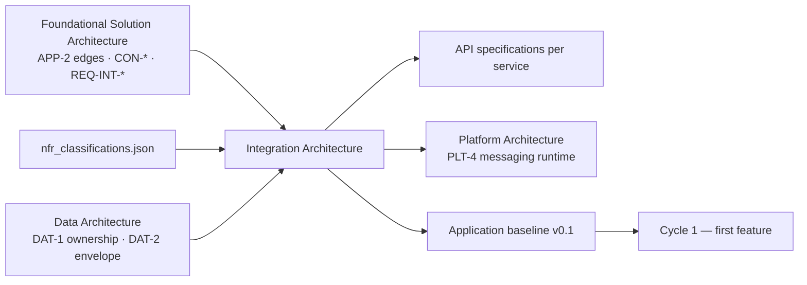

# Integration Architecture — Document Template

## 0. How to use this template

The Integration Architecture is the **canonical integration viewpoint (INT-\*)** for one product. It decides, once and before any epic is cut, which integration styles are permitted, when a call may be synchronous, who owns each contract, how events and APIs are named and versioned, and what every cross-context flow owes in latency, degraded mode and observability. It is produced at Cycle 0 (Phase 2.25) from the approved Foundational Solution Architecture, is gated by the Enterprise Architect alongside its two sibling viewpoints, and thereafter moves only by an `integration-architecture.delta.json` emitted from a feature cycle.

Integration is **not a deployable**. That is why it gets one cross-component canonical document rather than a section inside each service's HLD — and it is precisely why, in a purely component-shaped document topology, it had nowhere to live. It complements `L1-design-api-spec`, which produces contracts but not topology: that agent says what an endpoint looks like, this document says whether the endpoint should exist, who owns it, and what happens when it does not answer.

It owns exactly four things and deliberately nothing else:

1. **The rules** — INT-1 and INT-2: contract-mediated integration only, async as the default, and the conditions under which synchronous is justified.
2. **The conventions** — INT-3: event naming, event kinds, event versioning, API versioning.
3. **The register** — INT-4 and INT-5: every cross-context flow in the FSA's APP-2 component map, and every contract those flows imply.
4. **The obligations** — INT-6 to INT-9: reliability and failure policy, trust boundaries, observability requirements, and the contract change policy.

**The one-line tests for what belongs here.** Apply them to every sentence before it is written:

| Question | If yes… |
| --- | --- |
| Is it an endpoint's request or response payload, field by field? | It is **never** in this document. That is the service's OpenAPI specification. |
| Does it say whether an edge is synchronous or asynchronous, and why? | It is **only** in this document (INT-1.3, INT-4). |
| Is it a latency budget, timeout or degraded mode with no cited source? | It is not a value. It is `PENDING` with an INT-PEND row. |
| Does it choose the broker, gateway, mesh or identity product? | It is Platform (PLT-4, PLT-8, PLT-9). State the requirement; the runtime is theirs. |
| Does it say which context may *write* an entity? | It is Data (DAT-1). A contract never transfers ownership. |
| Does it describe what is deployed today, at which version, by which squad? | It is baseline payload. Never here — see Appendix A for the brownfield exception. |

**Section-ID spine.** `INT-1` … `INT-13`, the conformance checks `INT-Cn`, and the deferrals `INT-PEND-nn` are stable identifiers shared with the application baseline and the conformance checker. Headings may be reworded; IDs must never be renumbered or reused.

**Context, entity and edge names are not yours to change.** They match the FSA's APP-1 and APP-2 and the Data Architecture's DAT-1 exactly. An event named for a team, a system or a product rather than a bounded context is wrong even when it reads well.

**Template conventions used below.**

- Text in `[square brackets]` is a placeholder the authoring agent replaces.
- Lines beginning *Example:* are illustrative content drawn from the HarvestLink producer/buyer marketplace (Catalogue, Orders, Billing, Identity, Notifications). Delete them in a real document.
- Text diagrams are plain ASCII in fenced `text` blocks — readable in a terminal, a diff and a PR review.
- **A number is either traceable or `PENDING`.** A plausible timeout is an invention that will be implemented as if it were a decision.
- Mode-specific guidance is marked **[GF]** greenfield, **[BF]** brownfield retrofit, or **[BOTH]**.

## 1. Document control

Every field is required. A **major** bump means a normative change (a new permitted style, a flow changing style, a breaking versioning rule); a **minor** bump means a new registered flow or contract that changes no rule; a **patch** is editorial.

| Field | Value | Notes |
| --- | --- | --- |
| Document | Integration Architecture | Fixed |
| Document id | `int-[system-slug]` | *Example:* `int-harvestlink` |
| Canonical path | `/architecture/integration-architecture.md` | Same path in every project; agents key on it |
| Project / product | `[name]` | *Example:* HarvestLink Marketplace |
| Version | `[MAJOR.MINOR.PATCH]` | *Example:* `1.0` at Cycle 0 |
| Lifecycle stage | `Cycle 0` / `Cycle [n] delta` | Cycle 0 is the foundational invocation |
| Status | `DRAFT` / `IN REVIEW` / `APPROVED` / `SUPERSEDED` | Only `APPROVED` is normative |
| Mode | `GREENFIELD-CREATE` / `BROWNFIELD-RETROFIT` / `BROWNFIELD-DELTA` | Drives Appendix A |
| Owner | Integration Architect | Accountable human role |
| Authoring agent | `[agent id @ version]` | *Example:* `L1-design-integration-architect@1.0.0` |
| Parent document | `foundational-solution-architecture.md @ [version]` | The exact version read |
| Sibling read | `data-architecture.md @ [version]` | DAT-1 ownership and DAT-2 envelope are inputs, not restatements |
| Approval gate | Enterprise Architect (with Platform Lead at Cycle 0 exit) | Recorded in the version history |
| Downstream consumers | api-spec · platform-architect · arch-baseline-generator · env-provisioner (stub registry) · test scenario writers · gr-L1-architecture-conformance | Change the section spine and each of these breaks |

### 1.1 Version history

| Version | Date | Change type | Summary | Delta / ADR | Approver |
| --- | --- | --- | --- | --- | --- |
| `[1.0]` | `[date]` | Created | Initial Cycle 0 `[product]` integration rules and contract register | — | `[EA name]` |
| *Example:* 1.1 | 2026-06-18 | Registered (minor) | INT-4.4 consignment movement flow added; two contracts registered | `integration-architecture.delta.json` c4 | J. Okafor |

---

## 2. Purpose and Scope

### 2.1 Purpose statement

`[One paragraph for the Enterprise Architect, stating what this document decides for this product and why those decisions cannot be left to the first cycle that needs an answer.]`

*Example:* This document fixes how HarvestLink's five bounded contexts talk to each other, and to external parties whose technical capability ranges from a two-person farm to an established EDI estate. Without it, the first cycle that needs a fee at confirmation time will reach into Billing's store, and the second will copy the fee into Orders — and both will be defended as pragmatic.

### 2.2 What this document decides

- Which integration styles are permitted, and which are explicitly not.
- When a cross-context call may be synchronous, and what a synchronous edge owes.
- Who owns each contract, and what ownership means when a consumer wants a change.
- Event naming, event kinds, event versioning; API versioning.
- Every cross-context flow in APP-2, with its style, budget and degraded mode.
- Reliability obligations: duplicate handling, idempotency, retry, dead-letter, replay.
- Trust boundaries, correlation and observability requirements.

### 2.3 What this document must never contain

- Endpoint payloads field by field — that is the service's OpenAPI specification, produced by `L1-design-api-spec`.
- Broker, gateway, service-mesh or identity-provider product choices, cluster sizing or topic partition counts — that is PLT-4, PLT-8 and PLT-9.
- Entity ownership — that is DAT-1. A contract lets a consumer read; it never makes the consumer a writer.
- A latency budget, timeout or retention window invented to fill a cell.
- Deployed versions, owning squads, CMDB identifiers — baseline payload.

### 2.4 Position in the lifecycle



Integration runs after Data because the ownership register decides who may publish what, and before the per-service API specs because a contract needs an owner before it needs a schema. **[BF]** In brownfield this document is normally *read*, not written.

---

## 3. Inputs and provenance

List only what was actually read this run, at the version read.

### 3.1 Inputs consumed [BOTH]

| Input | Artifact and version read | What was taken from it | Mandatory |
| --- | --- | --- | --- |
| Foundational architecture | `foundational-solution-architecture.md @ [version]` | **APP-2.3 context interaction map — every edge**; APP-1 contexts; every CON-\* binding INT; every REQ-INT-\*; SEC-\* trust boundaries | Yes — **blocking** |
| NFR classification | `nfr_classifications.json @ [version]` | Latency budgets, availability classes and the source for every number in INT-4 | Yes — a flow register with no budgets is a diagram |
| Data architecture | `data-architecture.md @ [version]` | DAT-1 ownership (who may publish an entity's events), DAT-2 envelope, DAT-6 read models | Yes where it exists |
| Product requirements | `prd.md @ [version]` | Regulatory posture; which records are evidence; external-party scope | Recommended |
| Binding principles resolution | `binding-principles.json @ [version]` | Applicability, binding level, `program_guardrail`, `conformance_checks`, and the `fsa_hooks` whose `binds_viewpoints` contains `INT` | Optional — see 3.2 |

**Blocking input rule.** An FSA with no APP-2.3 interaction map is `INSUFFICIENT_CONTEXT`: there is no edge set to govern, and governing the edge set is this document's reason to exist. Derive nothing.

### 3.2 Knowledge bases consulted [BOTH]

| Knowledge base | Layer | Attached | What this document takes from it |
| --- | --- | --- | --- |
| `kb-L1-enterprise-architecture` | L1 enterprise | Yes | EA2 integration estate (ESB and API gateway, and that new digital products publish through the gateway rather than point-to-point); EA3 per-system integration posture — read-only, outbound-only, or no integration by design; EA4 "never direct database-to-database"; EA10 when an integration triggers mandatory EA review; BP0–BP14 principle catalogue and the BP11 resolution contract |
| `kb-L2-[domain]-api-patterns` | L2 domain — **the swappable half** | Yes | The domain's participant model and trust postures; its event taxonomy; the flows where async is genuinely wrong; what regulatory change does to versioning; the governed pattern for file-based partner exchange; the domain-specific observability signals a generic list misses |
| `kb-L1-enterprise-security` | L1 enterprise | Indirect | ES1 identity (external parties never on the employee IdP; server-side enforcement not bypassable); ES7 external-party vetting; ES9 residency, which applies to a file in transit exactly as to the entity |
| `kb-L1-nfr-classification-taxonomy` | L1 enterprise | Indirect | Read through `nfr_classifications.json`; the taxonomy every latency and availability budget came from |
| `kb-L2-domain-regulatory` | L2 domain | Indirect | Read through the PRD's regulatory posture; the source of any evidence-handling rule cited in INT-3.2 or INT-6 |
| `kb-L3-[project]-application-baseline` | L3 project | **[BF]** only | The as-built edges and existing contracts — evidence for Appendix A, never transcribed as intent |

**The domain KB is what makes this agent domain-aware.** The agent itself is domain-agnostic: deploying the framework against a different domain replaces that one file and changes nothing else. Where the domain KB draws a distinction — particularly its event taxonomy and its replay rules — that distinction is the one to use here, not a generic equivalent.

**BP11 resolution rule.** Validate `binding-principles.json` before use against its own `validation_rules`. A failing file is **unusable input**, not a non-conformant product — say which, and fall back to the FSA § 4 PRIN rows, recording here that you did so.

### 3.3 Edge coverage pre-check

Every edge in APP-2.3 is listed on intake, so an ungoverned integration is visible before INT-4 is written rather than after.

| APP-2.3 edge | From → To | Governed in | Style |
| --- | --- | --- | --- |
| `[edge]` | `[context] → [context]` | `[INT-4.n]` | `[sync / async]` |
| *Example:* listing availability | Orders → Catalogue | INT-4.1 | Synchronous |
| *Example:* order placed | Orders → Billing | INT-4.2 | Asynchronous |
| *Example:* payout scheduled | Billing → Notifications | INT-4.3 | Asynchronous |

---

## 4. Principles Applied

One subsection per principle binding INT. State what it requires **of this product**, quoting the `program_guardrail` where supplied.

| ID | Principle | Applicability | Binding level | Where it lands | Source |
| --- | --- | --- | --- | --- | --- |
| `[PRIN-nn]` | `[name]` | APPLIES / PARTIAL / NOT_APPLICABLE | MANDATORY / DIRECTIONAL / ADVISORY | `[INT section ids]` | `binding-principles.json` / FSA § 4 |
| *Example:* PRIN-03 | Integrate through governed, reusable interfaces | APPLIES | MANDATORY | INT-1.1, INT-2, INT-5, INT-11 | binding-principles.json |
| *Example:* PRIN-02 | One accountable owner and one authoritative source per data domain | APPLIES | MANDATORY | INT-1.1 (a contract grants read access, never ownership), INT-3.1 | binding-principles.json |
| *Example:* PRIN-06 | Security and privacy are designed in | APPLIES | MANDATORY | INT-7 | binding-principles.json |
| *Example:* PRIN-08 | Operability and observability are architecture, not operations | APPLIES | DIRECTIONAL | INT-8 | binding-principles.json |
| *Example:* PRIN-01 | Business outcome before technology choice | APPLIES | DIRECTIONAL | INT-12 — every deferral carries a trigger (PRIN-01-C1) | FSA § 4 |

### 4.[n] PRIN-[nn] — `[name]`

`[What this principle requires of this product, in this product's vocabulary. Quote the program_guardrail. Name the conformance check id it contributes — e.g. PRIN-03-C1, PRIN-03-C3 — and the INT-Cn that carries it in INT-11.]`

### 4.[n+1] Declared deviations and standing exceptions

A DIRECTIONAL deviation is a `DEV-xx` row here; a MANDATORY deviation needs an approved `EXC-xx` in the resolution file and is only referenced here. File-based partner exchange, where unavoidable, is recorded as a `TRANSITIONAL` exception with an owner and an exit date — never as a permanent style.

| ID | Principle | Where | Why | Compensating control | Review trigger / exit |
| --- | --- | --- | --- | --- | --- |
| `[DEV-01 / EXC-…]` | `[PRIN-nn]` | `[INT section]` | `[reason]` | `[control]` | `[condition or exit date]` |
| *Example:* DEV-01 | PRIN-03 (async preferred) | INT-4.1 | A fee shown at confirmation must be the fee charged; an eventually consistent copy can display a figure that has since changed | Latency budget, timeout and refusal-mode degraded behaviour all defined | If confirmation-time fee changes become impossible by policy, revisit as async |

---

# INT-1 — Integration Principles

## INT-1.1 Contract-Mediated Integration Only

`[What is permitted, as a text block; what is prohibited, as a text block.]`

```text
PERMITTED
  [Context A] ──► [contract owned by B] ──► [Context B]

PROHIBITED
  [Context A] ──► [Context B store]              direct data access
  [Context A] ──► [Context B internal function]  undeclared coupling
```

A contract grants a consumer the right to *read* or to *be told*. It never makes the consumer a writer of the producer's entities — ownership is DAT-1 and nothing here changes it.

## INT-1.2 Async Is the Default for Cross-Context Propagation

`[The rule and its condition, then a worked example flow from THIS product as a text diagram.]`

**Rule:** where the caller does not need the answer inside its own transaction, the propagation is asynchronous.

```text
[Context A] ──publishes──► [event] ──consumed by──► [Context B]
```

*Example:* Orders publishes `orders.order.placed`; Billing consumes it. Billing's availability must not gate order capture — a buyer who cannot be told their order exists is a worse outcome than a fee computed a second later.

## INT-1.3 Synchronous Calls Require Justification

**Condition:** synchronous is permitted only where the caller genuinely cannot complete its own transaction without the answer.

Every synchronous edge defines all five:

```text
latency budget          — the number, and where it came from
timeout                 — what the caller waits before giving up
degraded-mode behaviour — what happens when the answer does not arrive
ownership               — which context owns the contract
contract version        — the version in force
```

`[A worked example from this product, with the sentence that explains why the caller cannot proceed without the answer.]`

*Example:* Orders calls Catalogue to validate listing availability before creating an order. A buyer cannot be told "your order may exist"; the answer is needed inside the transaction. **Degraded mode is a refusal, not an optimistic assumption** — assuming availability sells goods that do not exist.

---

# INT-2 — Approved Integration Styles

| Style | Use | Example |
| --- | --- | --- |
| `[style]` | `[when it applies]` | `[a real edge from this product]` |
| *Example:* Synchronous request/response over a governed API | Answer required inside the caller's transaction | Orders → Catalogue availability check |
| *Example:* Asynchronous domain event | State change propagated to interested contexts | Orders → Billing order placed |
| *Example:* Outbound one-way feed | Aggregate, non-PII reporting to an enterprise system (EA3) | Metrics → group data warehouse |

**Not approved styles for this product:**

```text
direct database access between contexts
shared mutable tables
undocumented point-to-point calls that bypass the governed edge
file exchange as a permanent integration style
```

`[Where a partner genuinely cannot consume an API, state the governed file pattern here: the file is a transport for a versioned, owned, published contract; ingest converts it to domain events at the boundary so no downstream consumer learns a file was involved; the exchange is registered with an owner, a schedule, a duplicate rule and an exit plan with a date, as a TRANSITIONAL exception. Residency applies to the file and its staging copies exactly as to the entity.]`

---

# INT-3 — Contract and Topic Rules

## INT-3.1 Event Naming

```text
{context}.{entity}.{event}
```

Lowercase, dot-separated, past tense for the event segment. **The context segment is a bounded context name — never a team, a system or a product.**

*Example:* `catalogue.listing.published`, `orders.order.placed`, `billing.payout.scheduled`.

## INT-3.2 Event Kinds

Each registered event is classified by kind, because **the kind — not the name — decides ordering, retention and replay policy.** Conflating kinds is the most common modelling error in this layer.

| Kind | Meaning | Ordering | Retention | Replayable |
| --- | --- | --- | --- | --- |
| `[kind]` | `[meaning]` | `[guarantee]` | `[policy source]` | `[yes / no]` |
| *Example:* Lifecycle | A domain object changed state | Per aggregate | Application policy | Yes |
| *Example:* Evidence | Something legally assertable happened | Per aggregate, strict | Regulatory (ES3) | **No — replay is re-assertion** |
| *Example:* Movement | The physical world reported something | Best-effort; late and out-of-order arrivals are normal | Application policy | Yes |
| *Example:* Notification | A side effect for a human | None | Short | Yes, idempotently |

**State the trap your domain has, and state it here rather than in a footnote.** *Example:* replaying an evidence event does not re-deliver a fact — it asserts the fact a second time, with a second timestamp. A consumer that treats evidence like lifecycle produces two audit records for one real-world act. Every evidence event therefore carries a deduplication key derived from the business act, not from the message.

| Event | Kind | Ordering | Replay policy |
| --- | --- | --- | --- |
| `[event]` | `[kind]` | `[guarantee]` | `[policy]` |

## INT-3.3 Event Versioning

Every event contract carries an explicit version in the envelope (DAT-2.1).

`[What a compatible change may do; what a breaking change requires. Where the domain's regulatory change arrives as new mandatory fields on existing records, say what that means: version the contract additively, never backfill a value that was not captured, and never default it — old records genuinely lack it.]`

*Example:* an evidence contract's version is recorded **on the stored record**, not only on the message. Years later, "which rules applied when this was signed?" is answerable only from the record.

## INT-3.4 API Versioning

`[The scheme, with real path examples from this product, and what a consumer is entitled to when the version changes.]`

```text
/[major]/[resource]
```

`[State the deprecation window, and whether it differs for external parties. A two-person producer does not have a migration sprint; internal consumers do.]`

---

# INT-4 — Canonical Cross-Context Flow Register

One subsection per flow. **Cover every edge in the FSA's APP-2.3 component map** — an edge with no subsection here is an ungoverned integration, and `PRIN-03-C1` reports it.

## INT-4.[n] `[Flow name]`

### Purpose

`[What the flow achieves, in one or two sentences.]`

### Flow

```text
[Context A]
    │
    ▼  [what crosses]
[Context B]
    │
    ▼
[outcome]
```

### Owner of Contract

`[The context that owns it — the producer of the event, or the provider of the API.]`

### Style and Why

`[Synchronous or asynchronous, and the reason. For synchronous: the sentence explaining why the caller cannot complete its transaction without the answer.]`

### Required Design Values

| Value | This flow | Source |
| --- | --- | --- |
| Latency budget | `[value]` / `PENDING` | `[nfr_classifications.json ref / REQ-INT-nn]` |
| Timeout | `[value]` / `PENDING` | `[source]` |
| Degraded mode | `[behaviour]` | `[source]` |
| Contract version | `[version]` | INT-5 |

*Example — INT-4.1 Checkout listing validation:* budget p95 ≤ 300 ms (REQ-INT-04); timeout 1 s; degraded mode — **refuse the order and tell the buyer**, never assume availability; contract `catalogue.availability` v1.

**Never a plausible number.** A cell with no source is `PENDING` with an INT-PEND row, and the flow is still registered — an unbudgeted flow is a known gap, an invented budget is a false one.

---

# INT-5 — Initial Contract Register

Every contract implied by INT-4.

| Contract | Owner | Consumer | Style | Version | Initial State |
| --- | --- | --- | --- | --- | --- |
| `[name]` | `[owning context]` | `[consuming context]` | `[sync / async]` | `[version]` | `Planned` / `Active` |
| *Example:* `catalogue.availability` | Catalogue | Orders | Synchronous | v1 | Planned |
| *Example:* `orders.order.placed` | Orders | Billing | Asynchronous | 1.0.0 | Planned |

`Planned` means the architecture recognises the contract; the producing feature has not necessarily been implemented. The stub registry seeded in Phase 2.5 reads this table — a contract entry flips `stub → real` when the producing component's HLD and contract merge.

---

# INT-6 — Reliability and Failure Policy

## Synchronous Integrations

Every synchronous dependency shall define:

```text
timeout
retry policy (bounded, with backoff) — or explicitly none, with the reason
degraded-mode behaviour
```

`[A worked example of a failure and the explicitly defined behaviour — with the assumption it forbids stated plainly.]`

*Example:* Catalogue does not answer within the timeout. Orders refuses the order and surfaces a retryable error. It does **not** proceed on a last-known availability value: an unknown availability is a refusal, never an optimistic assumption.

## Asynchronous Integrations

Every consumer shall declare all five:

```text
duplicate handling  — the deduplication key, and what it is derived from
idempotency         — what "already applied" means for this consumer
retry strategy      — bounded; with what backoff
dead-letter path    — where a poison message goes, and who looks at it
replay policy       — for evidence-style events, usually "never"
```

`[A worked example of a duplicate delivery and what the consumer must not do. State any domain-specific rules: which kinds of event must derive their deduplication key from the business act rather than a message id; which kinds arrive late and out of order by nature and must be reconciled rather than rejected; which kinds may never be silently dropped from a dead-letter path because the real-world act still happened.]`

*Example:* `orders.order.placed` is delivered twice. Billing recognises the deduplication key and does not create a second Transaction. It must not create a compensating record instead — a duplicate is not a new business act.

---

# INT-7 — Identity and Trust Boundaries

`[Where identity originates for this product, as a text diagram.]`

```text
[external party] ──► [edge: identity established] ──► [context] ──► [context]
                          │
                          └── correlation id issued and carried onward
```

At **every** trust boundary:

- Caller identity is established — an identity established at the edge is not implicitly trusted two hops in.
- Authorization is applied at the point of the action, server-side; a rule the client can bypass by altering its own request is not a control (ES1).
- Correlation information is preserved across the hop.

`[Name the participant classes this product integrates with and the posture for each — including any that are read-only, time-scoped, or outbound-only by enterprise policy (EA3). External parties are never on the employee identity provider (ES1).]`

**The boundary:** the exact identity technology belongs to the Platform design (PLT-9). This section states which boundaries exist and what must happen at them.

---

# INT-8 — Integration Observability

Every integration must be observable through:

```text
correlation id propagated across every hop
trace spanning the full flow
latency measured per edge, against the INT-4 budget
error rate and failure classification per edge
dead-letter depth and age, with an owner
[domain-specific signal]
[domain-specific signal]
```

`[Add the domain signals a generic list misses. Examples from a regulated supply-chain domain: evidence-chain completeness — can the full chain be reconstructed from events alone, because a gap is a compliance finding that must be detectable before a regulator finds it; and external-party contract-version distribution — which partners are still on a deprecated version, because without it a deprecation date is a guess about who it will break.]`

**The split:** Platform Architecture provides the capability (PLT-12); Integration Architecture defines the requirement. A correlation id that the platform can carry but no integration sets is not observability.

---

# INT-9 — Contract Change Policy

## Compatible Change

`[A worked example, and the policy it may evolve under.]`

*Example:* adding an optional field to `orders.order.placed` v1.0.0 → v1.1.0. Existing consumers are unaffected and need not redeploy.

## Breaking Change

`[A worked example, then expand-and-contract as a text diagram, then the rule.]`

```text
1. provider supports old and new simultaneously
2. consumers migrate
3. old version deprecated, with a dated window
4. old version removed
```

**A provider release must not unexpectedly break an existing consumer.** Expand-and-contract is the only permitted path for a breaking change. `[State the deprecation window, and whether external-party windows are longer.]`

---

# INT-10 — Traceability to Principles and Demands

One row per REQ-INT-\*, per CON-\* binding INT, and per principle applied. Every one.

| Principle / Demand | Integration Decision |
| --- | --- |
| `[REQ-INT-nn / CON-n / PRIN-nn]` | `[INT section id + one line saying how]` |
| *Example:* REQ-INT-04 (availability check ≤ 300 ms) | INT-4.1 states the budget, the timeout and a refusal degraded mode; INT-C3 checks it |
| *Example:* CON-3 (all cross-context traffic through governed contracts) | INT-1.1 states the rule; INT-5 registers every contract; INT-C1 checks coverage |

---

# INT-11 — Conformance Checks

One subsection per check, each expressed so a checker can evaluate it. Cover at minimum: every cross-context edge has a contract; no cross-context database grants; every synchronous call is budgeted and has a degraded mode.

## INT-C1 — Every Cross-Context Edge Has a Contract

```text
for each edge in fsa.APP-2.3:
    exists contract in INT-5 with owner and version
severity: MAJOR               source: PRIN-03-C1
```

## INT-C2 — No Cross-Context Direct Data Access

```text
count(cross_context_db_grants) == 0
    excluding exceptions where type == LEGACY_CONTAINMENT
severity: BLOCKING            source: PRIN-03-C2
```

## INT-C3 — Synchronous Calls Are Budgeted

```text
for each flow in INT-4 where style == synchronous:
    exists latency_budget and exists timeout and exists degraded_mode
    or exists INT-PEND row with trigger
severity: MAJOR               source: PRIN-03-C3
```

## INT-C[n] — `[additional check this product needs]`

```text
[evaluable expression]
severity: [BLOCKING | MAJOR | MINOR]    source: [principle check id]
```

---

# INT-12 — Pending Decisions

| ID | Decision | Status | Trigger |
| --- | --- | --- | --- |
| `INT-PEND-nn` | `[what is not yet decided]` | `PENDING` | `[the condition that reopens it]` |
| *Example:* INT-PEND-01 | Partner file-exchange pattern | PENDING | A distributor with an EDI-only estate is committed to the roadmap |
| *Example:* INT-PEND-02 | Notification delivery latency budget | PENDING | An NFR classification supplies a delivery-time obligation |

**A trigger is a condition, never a date.** Every `PENDING` in this document has a row here, and every row is referenced from the section that defers it.

---

# INT-13 — Feature Delta Model

Feature cycles do **not** rewrite this document. They emit a delta:

```json
{
  "target_document": "integration-architecture.md",
  "from_version": "1.0",
  "changes": [
    {
      "type": "add_flow | add_contract | change_style | resolve_pending | deprecate_contract",
      "section": "INT-4.4",
      "content": "[the change]"
    }
  ],
  "version_bump": "minor | major",
  "structural": false,
  "adr_required": false
}
```

The transition: a delta is merged only after the feature that motivated it is merged and verified. The merge raises the version per § 1, appends a version-history row, and re-runs INT-11. A `structural: true` delta — a new permitted style, a flow changing from async to sync, a breaking versioning rule — requires an ADR and the Enterprise Architect gate before merge.

---

## Version History

| Version | Change |
| --- | --- |
| 1.0 | Initial Cycle 0 `[product]` integration rules and contract register |

---

## Appendix A — Brownfield reconciliation [BF]

Present only in `BROWNFIELD-RETROFIT`, or where a delta reconciles known drift.

### A.1 Recovery method

`[What was read — application-baseline.md, api-surface.yaml, gateway and broker configuration, grant tables — and at what commit or export date.]`

### A.2 Divergence register

| INT section | Target says | Baseline shows | Classification | Resolution |
| --- | --- | --- | --- | --- |
| `[INT-5]` | `[intended contract and owner]` | `[actual edge]` | Drift / Accepted exception / Target error | `[remediation or EXC id]` |
| *Example:* INT-1.1 | All cross-context traffic through contracts | Reporting reads Orders' store directly | Drift — BLOCKING (PRIN-03-C2) | `LEGACY_CONTAINMENT` exception with exit plan, or remediation epic |

### A.3 Known violations not to be encoded as intent

`[From binding-principles.json brownfield.principle_posture. A retrofit that promotes an existing point-to-point call into INT-2 as an approved style has laundered it.]`

---

## Appendix B — Authoring agent self-check and quality gate

### B.1 Content boundary — BLOCKING

- [ ] No endpoint payload schemas, field lists or example request bodies (that is the OpenAPI spec).
- [ ] No broker, gateway, mesh or identity product names; no partition counts or cluster sizing (that is PLT).
- [ ] No entity ownership claims that differ from DAT-1.
- [ ] No deployed versions, squads or CMDB ids.

### B.2 Completeness — BLOCKING

- [ ] Every edge in APP-2.3 has an INT-4 subsection; the § 3.3 pre-check table and INT-4 agree.
- [ ] Every INT-4 flow has a contract row in INT-5, with an owner and a version.
- [ ] Every synchronous flow states latency budget, timeout, degraded mode, ownership and contract version — or a `PENDING` with an INT-PEND trigger.
- [ ] Every registered event has a kind in INT-3.2, and its ordering, retention and replay policy follow from that kind.
- [ ] Every REQ-INT-\* and every INT-binding CON-\* has an INT-10 row.
- [ ] INT-11 contains at least INT-C1, INT-C2 and INT-C3 as evaluable expressions.

### B.3 Grounding — BLOCKING

- [ ] No latency budget, timeout or deprecation window appears that no cited source supports.
- [ ] Event names use `{context}.{entity}.{event}` with a real APP-1 context in the first segment.
- [ ] Any synchronous edge is justified by the caller genuinely needing the answer inside its transaction — not by convenience or by "it is simpler".
- [ ] Degraded modes are real behaviours (refuse, defer, queue), not "proceed on last known value" where the domain forbids it.
- [ ] If `binding-principles.json` was absent or failed validation, § 4 says so and names the fallback — distinguishing *unusable input* from *non-conformant product*.

### B.4 Quality — review findings

- [ ] The domain KB's distinctions are used, not paraphrased away into a generic taxonomy.
- [ ] External-party integration posture accounts for uneven technical capability, where the domain has it.
- [ ] Text diagrams are plain ASCII in fenced `text` blocks.
- [ ] Guardrails evaluated and recorded: `gr-L1-consistency-check`, `gr-L1-schema-validator`; downstream `gr-L1-architecture-conformance`.

### B.5 Anti-patterns the reviewer looks for

| Anti-pattern | Why it fails |
| --- | --- |
| A flow register that is a diagram | Without budgets, timeouts and degraded modes it governs nothing |
| "Retry with exponential backoff" as the degraded mode | Retrying is not a behaviour the user experiences; refuse, defer or queue is |
| An evidence event with a replay policy of "yes" | Replay re-asserts the fact; it produces two audit records for one real act |
| A deduplication key derived from the message id | Producers regenerate message ids on retry; the key must derive from the business act |
| A synchronous edge justified by "it is simpler" | Simplicity is not the test; the test is whether the caller can complete without the answer |
| File exchange registered as an approved style | It is a TRANSITIONAL exception with an owner and an exit date, or it is not permitted |
| An APP-2.3 edge with no INT-4 subsection | An ungoverned integration — the one thing this document exists to prevent |
