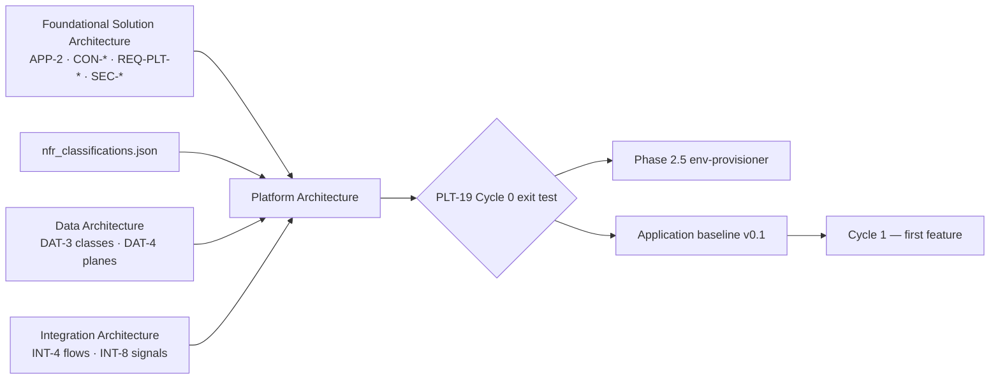

# Platform Architecture — Document Template

## 0. How to use this template

The Platform Architecture is the **canonical platform viewpoint (PLT-\*)** for one product: runtime topology, persistence and messaging capability, object storage, networking, workload identity and secrets, encryption realisation, CI/CD and supply chain, observability, environments, resilience and DR. It is produced at Cycle 0 (Phase 2.25), gated by the Enterprise Architect with the Platform Lead signing off the Cycle 0 exit test, and thereafter moves only by a `platform-architecture.delta.json` emitted from a feature cycle.

**Why platform cannot be a subsection of a feature HLD.** The four viewpoints run on different cadences. Application architecture changes roughly in proportion to features delivered; platform is about 80% front-loaded. A feature cycle's platform delta is empty most of the time and occasionally very large — a completely different shape from application architecture. Smuggling this work into the first real feature cycle is what makes that feature take three times its estimate and forces platform decisions under delivery pressure.

Its distinguishing output is **PLT-6, the capability register**: a table of what the platform can currently support. That table turns "did we think about platform?" from a judgement call into a lookup the impact assessor performs mechanically — which is why a capability that is `NOT PRESENT` still gets a row. A capability absent from the table cannot be looked up, and the lookup is the point.

**The one-line tests for what belongs here.** Apply them to every sentence before it is written:

| Question | If yes… |
| --- | --- |
| Is it a resource definition, a module, a variable file, a pipeline YAML? | It is **never** in this document. That is the platform repository's IaC. |
| Does it say which technology or managed service realises a capability? | It is **only** in this document. Unlike the FSA, this document *may* name products. |
| Is it an availability target, RTO or RPO with no NFR behind it? | It is not a value. It is `PENDING` with a PLT-PEND row. |
| Does it say which context owns an entity? | It is Data (DAT-1). Provisioning a schema does not create ownership. |
| Does it name a topic, a contract or a retry policy? | It is Integration (INT-3, INT-6). This document owns the broker runtime, not the taxonomy on it. |
| Does it record what is deployed today, at which version, by which squad? | It is baseline payload. Never here — see Appendix A for the brownfield exception. |

**Section-ID spine.** `PLT-1` … `PLT-19`, the conformance checks `PLT-Cn`, and the deferrals `PLT-PEND-nn` are stable identifiers shared with the application baseline, the impact assessor and the conformance checker. Headings may be reworded; IDs must never be renumbered or reused. **PLT-6 in particular is read mechanically by every later impact assessment** — its column set is not a stylistic choice.

**Template conventions used below.**

- Text in `[square brackets]` is a placeholder the authoring agent replaces.
- Lines beginning *Example:* are illustrative content drawn from the HarvestLink producer/buyer marketplace (Catalogue, Orders, Billing, Identity, Notifications). Delete them in a real document.
- Text diagrams are plain ASCII in fenced `text` blocks — readable in a terminal, a diff and a PR review.
- **Values not provided by NFRs remain `PENDING` rather than being invented.** An availability target nobody asked for becomes an SLO somebody is paged for.
- Mode-specific guidance is marked **[GF]** greenfield, **[BF]** brownfield retrofit, or **[BOTH]**.

## 1. Document control

Every field is required. A **major** bump means a normative change (a new capability, a topology change, a technology replaced); a **minor** bump means a capability status transition or a resolved pending decision; a **patch** is editorial.

| Field | Value | Notes |
| --- | --- | --- |
| Document | Platform Architecture | Fixed |
| Document id | `plt-[system-slug]` | *Example:* `plt-harvestlink` |
| Canonical path | `/architecture/platform-architecture.md` | Same path in every project; agents key on it |
| Project / product | `[name]` | *Example:* HarvestLink Marketplace |
| Version | `[MAJOR.MINOR.PATCH]` | *Example:* `1.0` at Cycle 0 |
| Lifecycle stage | `Cycle 0` / `Cycle [n] delta` | Cycle 0 is the foundational invocation |
| Status | `DRAFT` / `IN REVIEW` / `APPROVED` / `SUPERSEDED` | Only `APPROVED` is normative |
| Mode | `GREENFIELD-CREATE` / `BROWNFIELD-RETROFIT` / `BROWNFIELD-DELTA` | Drives Appendix A |
| Owner | Platform Architect | Accountable human role |
| Authoring agent | `[agent id @ version]` | *Example:* `L1-design-platform-architect@1.0.0` |
| Parent document | `foundational-solution-architecture.md @ [version]` | The exact version read |
| Siblings read | `data-architecture.md @ [version]` · `integration-architecture.md @ [version]` | Their requirements become capabilities here |
| Approval gates | Enterprise Architect (document) · **Platform Lead (PLT-19 Cycle 0 exit test)** | Both recorded in the version history |
| Platform repository | `[repo ref]` | Holds the IaC that implements this document |
| Downstream consumers | env-provisioner · arch-baseline-generator · impact-assessor (reads PLT-6 every cycle) · test-strategy · gr-L1-architecture-conformance | Change the section spine and each of these breaks |

### 1.1 Version history

| Version | Date | Change type | Summary | Delta / ADR | Approver |
| --- | --- | --- | --- | --- | --- |
| `[1.0]` | `[date]` | Created | Initial Cycle 0 `[product]` Platform Architecture | — | `[EA name]` |
| *Example:* 1.1 | 2026-07-09 | Capability (minor) | PLT-6 search capability NOT PRESENT → AVAILABLE | `platform-architecture.delta.json` c2 | A. Reyes |

---

## 2. Purpose and Scope

### 2.1 What this document defines

- Compute and runtime model for backend and front-end workloads.
- Persistence capability and the access boundary between contexts.
- Event/messaging infrastructure — the runtime, not the taxonomy.
- Object storage capability.
- Network architecture and ingress posture.
- Environment model, deployment and supply chain.
- Security capabilities: workload identity, secrets, encryption realisation.
- Observability platform and the signals it must carry.
- Scalability, resilience and disaster recovery.
- **PLT-6, the capability register that every later impact assessment reads.**

Unlike the Foundational Solution Architecture, this document **may and must name technologies and managed services**. Detailed IaC resource definitions remain in the platform repository; what lives here is the architectural capability and its state.

### 2.2 What this document must never contain

- IaC resource definitions, module source, variable files, pipeline YAML.
- Entity ownership — that is DAT-1. Provisioning a schema does not transfer domain ownership.
- Topic names, contract versions, retry policy, event taxonomy — that is INT-3 and INT-6.
- An availability target, RTO or RPO that no NFR supplies.
- Deployed versions, owning squads, CMDB identifiers — baseline payload.
- A technology named without its lifecycle-status check.

### 2.3 Position in the lifecycle



Platform runs last of the three viewpoints because it realises what the other two require, and **before** Phase 2.5: the environment provisioner cannot provision environments until the platform exists. Cycle 0 delivers no user-visible feature, and that is the point.

---

## 3. Inputs and provenance

List only what was actually read this run, at the version read.

### 3.1 Inputs consumed [BOTH]

| Input | Artifact and version read | What was taken from it | Mandatory |
| --- | --- | --- | --- |
| Foundational architecture | `foundational-solution-architecture.md @ [version]` | APP-1 contexts and APP-2 components (one deployable per context at minimum); every CON-\* binding PLT; every REQ-PLT-\*; SEC-\* trust boundaries and controls | Yes — **blocking** |
| NFR classification | `nfr_classifications.json @ [version]` | Availability targets, latency budgets, RTO/RPO, scaling triggers — the source for every number in PLT-14 | Yes |
| Data architecture | `data-architecture.md @ [version]` | DAT-3 classification (what must be encrypted and isolated), DAT-4 plane decisions (what persistence capability is required) | Yes where it exists |
| Integration architecture | `integration-architecture.md @ [version]` | Whether an async edge exists at all (PLT-4), the correlation signals PLT-12 must carry, the trust boundaries PLT-9 must serve | Yes where it exists |
| Binding principles resolution | `binding-principles.json @ [version]` | Applicability, binding level, `program_guardrail`, `conformance_checks`, and the `fsa_hooks` whose `binds_viewpoints` contains `PLT` | Optional — see 3.2 |
| Technology lifecycle register | `[approved-platform catalogue @ version]` | Lifecycle status per product — the input `PRIN-07-C1` evaluates against | Yes where the enterprise maintains one |

### 3.2 Knowledge bases consulted [BOTH]

| Knowledge base | Layer | Attached | What this document takes from it |
| --- | --- | --- | --- |
| `kb-L1-enterprise-architecture` | L1 enterprise | Yes | EA2 group technology stack and its status (what already exists, what is mandated for new digital products, what is mid-migration); EA3 which systems may be touched and how; EA4 "new services independently deployable, own datastore, no shared database with legacy"; EA6 support tiers and the rule that a new product sets its own tier rather than inheriting one; EA9 rollout mandates; EA10 when a platform decision triggers mandatory EA review; BP0–BP14 principle catalogue and the BP11 resolution contract |
| `kb-L1-enterprise-security` | L1 enterprise | Yes | ES1 identity boundaries; ES4 availability tiering for new systems holding legally relevant records; ES5 secure SDLC — vault-managed secrets, CI dependency and vulnerability scanning, pen test before first external onboarding; ES6 named incident-response owner before launch; ES9 approved operating regions; ES10 encryption, key rotation, per-component workload identity, attributable access |
| `kb-L1-nfr-classification-taxonomy` | L1 enterprise | Indirect | Read through `nfr_classifications.json`; the taxonomy every availability and RTO/RPO value came from |
| `kb-L1-testing-standards` | L1 enterprise | Indirect | Read by Phase 2.5, which provisions against PLT-13 — the environment model here must be provisionable |
| `kb-L2-[domain]-api-patterns` | L2 domain | Indirect | Read through the Integration Architecture; the domain signals PLT-12 must be able to carry |
| `kb-L3-[project]-application-baseline` | L3 project | **[BF]** only | The as-built estate — evidence for Appendix A, never transcribed as intent |

**BP11 resolution rule.** Validate `binding-principles.json` before use against its own `validation_rules`. A failing file is **unusable input**, not a non-conformant product — say which, and fall back to the FSA § 4 PRIN rows, recording here that you did so.

### 3.3 Demand coverage pre-check

| Demand / constraint | Source | Budget or rule stated upstream | Realised in |
| --- | --- | --- | --- |
| `[REQ-PLT-01]` | `[FSA § REQ-PLT]` | `[capability class + budget]` | `[PLT-n]`, PLT-6 row |
| *Example:* REQ-PLT-02 | FSA § REQ-PLT | Every context independently deployable | PLT-1, PLT-6, PLT-C3 |
| *Example:* DAT-3.3 | Data Architecture | PII and Financial encrypted at rest and in transit | PLT-10, PLT-C4 |
| *Example:* INT-8 | Integration Architecture | Correlation id propagated across every hop | PLT-12, PLT-C[n] |

---

## 4. Principles Applied

One subsection per principle binding PLT. State what it requires **of this product**, quoting the `program_guardrail` where supplied.

| ID | Principle | Applicability | Binding level | Where it lands | Source |
| --- | --- | --- | --- | --- | --- |
| `[PRIN-nn]` | `[name]` | APPLIES / PARTIAL / NOT_APPLICABLE | MANDATORY / DIRECTIONAL / ADVISORY | `[PLT section ids]` | `binding-principles.json` / FSA § 4 |
| *Example:* PRIN-04 | Decompose by business capability — capability-aligned deployability | APPLIES | MANDATORY | PLT-1, PLT-6, PLT-C3 (PRIN-04-C2) | binding-principles.json |
| *Example:* PRIN-06 | Security and privacy are designed in | APPLIES | MANDATORY | PLT-9, PLT-10, PLT-C4 (PRIN-06-C2) | binding-principles.json |
| *Example:* PRIN-07 | Prefer strategically approved platforms and managed services | APPLIES | MANDATORY | PLT-3, PLT-4, PLT-5, PLT-15, PLT-C2 (PRIN-07-C1) | binding-principles.json |
| *Example:* PRIN-08 | Operability and observability are architecture, not operations | APPLIES | MANDATORY | PLT-12, PLT-C[n] (PRIN-08-C1) | binding-principles.json |
| *Example:* PRIN-03 | Integrate through governed, reusable interfaces | PARTIAL — the credential half | MANDATORY | PLT-3 Access Boundary, PLT-C1 (PRIN-03-C2) | binding-principles.json |
| *Example:* PRIN-05 | Reuse before buy before build | APPLIES | DIRECTIONAL | PLT-6 (a capability the enterprise already provides is consumed, not rebuilt) | FSA § 4 |

**PRIN-07 belongs in this section even when the resolution marks it NOT_APPLICABLE at FSA level** (BP8). The FSA states demands as capability classes precisely so that the approved-platform lookup can happen here. If nobody performs it here, nobody performs it at all.

### 4.[n] PRIN-[nn] — `[name]`

`[What this principle requires of this product, in this product's vocabulary. Quote the program_guardrail. Name the conformance check id it contributes and the PLT-Cn that carries it in PLT-16.]`

### 4.[n+1] Declared deviations and standing exceptions

| ID | Principle | Where | Why | Compensating control | Review trigger / exit |
| --- | --- | --- | --- | --- | --- |
| `[DEV-01 / EXC-…]` | `[PRIN-nn]` | `[PLT section]` | `[reason]` | `[control]` | `[condition or exit date]` |
| *Example:* EXC-PRIN-07-001 (TRANSITIONAL) | PRIN-07 | PLT-3 | A required capability's approved product is mid-migration at group level (EA8) | Pinned version; migration tracked with the group programme | Exit when the group migration completes; owner Core IT |

---

# PLT-1 — Runtime Architecture

## Backend Workloads

`[Technology, deployment target, and the initial workload mapping — one entry per context's service. State that each is independently deployable.]`

| Workload | Context served | Runtime | Independently deployable |
| --- | --- | --- | --- |
| `[service]` | `[APP-1 context]` | `[technology + deployment target]` | Yes |

*Example:* every HarvestLink context maps to at least one independently deployable service. `PRIN-04-C2` (BLOCKING) checks that each bounded context has one; a context with none has been designed as a library, not a capability.

## Front-End Workloads

`[Technology and the applications, if the product has any. Omit if it has none.]`

---

# PLT-2 — High-Level Platform Topology

One text diagram: users at the top, through the application/API layer, into per-context services and their stores, with async workloads and any upstream identity capability shown separately.

```text
        [users / external parties]
                   │
          [public ingress / gateway]
                   │
        ┌──────────┴───────────┐
   [context service]      [context service]
        │                      │
   [context schema]       [context schema]
        │                      │
        └──────► [messaging capability] ◄──────┘
                   │
            [async workloads]

   [identity capability] ──► established at the edge, carried onward
```

---

# PLT-3 — Persistence Platform

## Relational Capability

`[Technology, capability status, and the realization mapping each context to its own schema. State the PRIN-07 lifecycle check and its outcome.]`

```text
[Context] ──► [context schema]
[Context] ──► [context schema]
```

**Platform provisioning does not create cross-context data ownership.** Ownership is DAT-1.1; a schema is infrastructure.

## Access Boundary

Which credential reaches which persistence:

```text
[context service credential] ──► [own context schema]      PERMITTED
[context service credential] ──► [another context schema]  PROHIBITED
```

The platform **shall prevent** an application credential from reading another context's schema. This is where `PRIN-03-C2` (BLOCKING) is actually enforced — DAT-1.b states the rule, and this section is the mechanism that makes it true rather than aspirational.

---

# PLT-4 — Messaging Platform

`[Technology, capability status, purpose, and the availability and capacity posture.]`

**The ownership split, stated explicitly because it is the one most often blurred:**

| Owned by Integration Architecture (INT) | Owned by Platform Architecture (PLT) |
| --- | --- |
| Topic naming and taxonomy | The broker runtime and its version |
| Contract rules and versioning | Availability, capacity and scaling |
| Producer/consumer semantics, retry and replay policy | Networking, authentication and authorisation to the broker |
| What a dead-letter path means | That a dead-letter path exists and is monitored |

Omit this section only if the product genuinely has no asynchronous edge — and if INT-4 registers one, it does not.

---

# PLT-5 — Object Storage

`[Capability, the product's use case, capability status, and the split: the application retains metadata and reference, the platform stores the binary. Omit if the product has no object data — cross-check DAT-4.2.]`

```text
[context service]
   ├── metadata + reference ──► [context schema]
   └── binary               ──► [object capability]
```

---

# PLT-6 — Capability Register

**This register is checked by every later feature Impact Assessment.** It is the reason the platform architect does not fire in most cycles: the assessor looks a capability up rather than convening a discussion.

| Capability | Realization | Status | Lifecycle Check | Consumer / Reason |
| --- | --- | --- | --- | --- |
| `[capability class]` | `[technology or managed service]` | `AVAILABLE` / `PARTIAL` / `NOT PRESENT` | `[approved catalogue + lifecycle status]` | `[which context or demand needs it]` |
| *Example:* Relational persistence | Managed relational service | AVAILABLE | Approved; `invest` | All contexts (DAT-4.1) |
| *Example:* Asynchronous messaging | Managed event broker | AVAILABLE | Approved; `invest` | INT-4.2, INT-4.3 |
| *Example:* Object storage | Managed object store | AVAILABLE | Approved; `invest` | DAT-4.2 |
| *Example:* Full-text search | — | **NOT PRESENT** | — | No committed requirement; a buyer-search feature would need it |
| *Example:* Analytical plane | — | **NOT PRESENT** | — | Deferred; DAT-4.3 trigger conditions |

**Include capabilities that are `NOT PRESENT`.** A capability absent from this table cannot be looked up, and the lookup is the whole point of the register.

**Definition — and it is a strict one.** `AVAILABLE` means the capability is technically provisioned and consumable by a workload today. It does **not** mean "we know which product we might use", "it is in the catalogue", or "a ticket is open". `PARTIAL` means provisioned but not for every context or environment, and the gap is stated in the row.

---

# PLT-7 — Capability Gap Rule

```text
feature requirement
      │
      ▼
required capability
      │
      ▼
check PLT-6
      │
      ├── AVAILABLE and no topology change ──► PLT viewpoint = NONE
      └── NOT PRESENT or PARTIAL ───────────► PLT DELTA REQUIRED
```

## Example — a feature whose capabilities are all AVAILABLE

*Example (Cycle 1, producer listing):* needs relational persistence (AVAILABLE), asynchronous messaging (AVAILABLE), object storage for listing images (AVAILABLE). No new capability, no topology change. **Platform viewpoint for this cycle: NONE.** The platform architect does not fire.

## Example — a feature needing a capability that is NOT PRESENT

*Example (Cycle 2, buyer search):* needs full-text search, which PLT-6 records as NOT PRESENT. **Platform delta required.** The cycle carries platform work explicitly rather than discovering it mid-sprint, and on merge the PLT-6 row transitions `NOT PRESENT → AVAILABLE` with its realization and lifecycle check filled in.

---

# PLT-8 — Network Architecture

```text
[public ingress]
      │
[application endpoints]
      │
[private application network]
      │
[data and messaging capabilities — not publicly reachable]
```

`[State the ingress posture, and any enterprise mandate that applies — e.g. where a group gateway is mandatory for new digital products rather than point-to-point exposure (EA2).]`

Internal data and messaging capabilities **must not be unnecessarily exposed publicly**. A store reachable from the internet because it was convenient during Cycle 0 is reachable from the internet in production.

---

# PLT-9 — Identity, Secrets and Access

Each independently deployable component receives **its own workload identity**.

```text
[context service A] ──► workload identity A ──► [own schema, own secrets]
[context service B] ──► workload identity B ──► [own schema, own secrets]
```

Prohibitions, stated as prohibitions:

- Two bounded contexts **must not** share an application credential (`PRIN-06-C2`, BLOCKING).
- Secrets **must not** be hardcoded or committed; they are held in the group secrets vault (ES5).
- A secret that cannot be rotated without redeploying unrelated consumers is a design defect, not an operational inconvenience (ES10).
- Access to PII, Financial and Regulated-Evidence data must be **attributable to a named principal** — a shared service account reading a PII store satisfies encryption and fails attribution (ES1, ES10).

`[Name the identity capability for external parties, per ES1 — the employee identity provider has no external-party tier and must not be extended to one.]`

---

# PLT-10 — Encryption

```text
encryption at rest      — [realization]
encryption in transit   — [realization]
key management          — [group managed key capability]
key rotation            — [mechanism, without redeploying unrelated consumers]
```

Applies to the classes DAT-3 names: `[list the classes]`.

**The split:** the Data Architecture states the requirement (DAT-3.3); this section records the realisation. A class protected in DAT-3.3 with no realisation here is the gap `PLT-C4` reports.

---

# PLT-11 — CI/CD Architecture

```text
source ──► build ──► test ──► scan ──► package ──► deploy ──► observe
```

`[Per stage: what runs, and what blocks a release. Include the enterprise pre-launch requirements that bind a new external-facing product — dependency and vulnerability scanning in CI before any release to an external-facing environment; a completed and remediated penetration test before first external-user onboarding, not before internal or staging use; security review of any new external identity integration before go-live (ES5).]`

Infrastructure is defined through IaC. **A feature must not require manual infrastructure creation as its normal delivery mechanism** — a platform that needs a human to click is a platform that has no environments, only instances.

---

# PLT-12 — Observability Platform

```text
structured logs
metrics
distributed tracing
correlation id propagation
alerting with named owners
dashboards per deployable
```

All workloads **must propagate the correlation identifiers the Integration Architecture defines** (INT-8). `PRIN-08-C1` checks that every deployable emits logs and metrics and propagates a correlation id.

`[State the domain-specific signals INT-8 requires the platform to be able to carry.]`

`[Name the incident-response owner requirement: a new external-facing system has a named owner before launch, not assigned retroactively after a first incident (ES6).]`

---

# PLT-13 — Environment Strategy

| Environment | Purpose |
| --- | --- |
| `[name]` | `[what it is for, and who uses it]` |
| *Example:* Development | Engineer-facing; freely rebuilt |
| *Example:* Test | Automated test execution; the environment Phase 2.5 provisions against |
| *Example:* Production | External users |

**Environment differences should be configuration and capacity differences, not different architecture patterns.** A test environment that reaches a store directly because the gateway "is not needed there" tests a system that does not exist.

---

# PLT-14 — Resilience

| Dimension | Value | Source |
| --- | --- | --- |
| Availability target | `[value]` / `PENDING` | `[nfr_classifications.json ref / ES4 tier]` |
| RTO | `[value]` / `PENDING` | `[source]` |
| RPO | `[value]` / `PENDING` | `[source]` |
| Backup and restore | `[policy]` / `PENDING` | `[source]` |
| Multi-zone deployment | `[posture]` | `[source]` |
| Scaling policy | `[trigger and bounds]` / `PENDING` | `[source]` |

**Values not provided by NFRs remain `PENDING` rather than being invented**, each with a PLT-PEND row and a trigger. A tier is stated explicitly, never silently inherited from an unrelated existing system's SLA (EA6, ES4). Where the product holds legally relevant audit or compliance records, ES4 sets the floor.

Backups, DR copies and log exports **inherit the residency of the source entity** (DAT-3.2, ES9). A DR region chosen without checking this breaks a residency rule that was in force.

---

# PLT-15 — Technology Lifecycle Compliance

```text
for each technology named in this document:
    lifecycle_status not in [contain, retire]
    or exists approved exception with exit plan
```

This applies to **future platform deltas too**. A capability added in Cycle 7 is checked the same way as one added at Cycle 0 — the rule is not a Cycle 0 ritual.

---

# PLT-16 — Platform Conformance Checks

One subsection per check, each expressed so a checker can evaluate it. Cover at minimum: isolation, technology lifecycle, deployability, classified-data protection.

## PLT-C1 — Isolation

```text
count(credentials granting a context access to another context's schema) == 0
    excluding exceptions where type == LEGACY_CONTAINMENT
severity: BLOCKING            source: PRIN-03-C2
```

## PLT-C2 — Technology Lifecycle

```text
for each technology in platform-architecture.md:
    lifecycle_status not in [contain, retire] or exists exception
severity: MAJOR               source: PRIN-07-C1
```

## PLT-C3 — Deployability

```text
for each bounded_context in fsa.APP-1:
    count(independently_deployable_components) >= 1
severity: BLOCKING            source: PRIN-04-C2
```

## PLT-C4 — Classified Data Protection

```text
for each entity in data-architecture.DAT-3.2 where classification in
        [PII, Financial, Confidential, Regulated Evidence]:
    encrypted_at_rest and encrypted_in_transit
    and key_in_managed_capability
    and access_attributable_to_principal
severity: BLOCKING            source: PRIN-06-C1, ES10
```

## PLT-C[n] — `[additional check this product needs]`

```text
[evaluable expression]
severity: [BLOCKING | MAJOR | MINOR]    source: [principle check id]
```

---

# PLT-17 — Pending Decisions

| ID | Decision | Status | Trigger |
| --- | --- | --- | --- |
| `PLT-PEND-nn` | `[what is not yet decided]` | `PENDING` | `[the condition that reopens it]` |
| *Example:* PLT-PEND-01 | RTO and RPO targets | PENDING | An NFR classification supplies a recovery obligation for a transactional context |
| *Example:* PLT-PEND-02 | Search capability realisation | PENDING | A committed requirement needs full-text search (PLT-6 row transitions) |

**A trigger is a condition, never a date.** Every `PENDING` in this document has a row here, and every row is referenced from the section that defers it (`PRIN-01-C1`).

---

# PLT-18 — Platform Delta Model

Feature cycles do **not** rewrite this document. They emit a delta, and a platform delta characteristically includes a PLT-6 status transition:

```json
{
  "target_document": "platform-architecture.md",
  "from_version": "1.0",
  "changes": [
    {
      "type": "add_capability | change_topology | resolve_pending | replace_technology",
      "section": "PLT-6",
      "content": "[the change]",
      "capability_transition": {
        "capability": "[capability class]",
        "from_status": "NOT PRESENT",
        "to_status": "AVAILABLE",
        "realization": "[technology]",
        "lifecycle_check": "[approved + status]"
      }
    }
  ],
  "version_bump": "minor | major",
  "structural": false,
  "adr_required": false
}
```

The **platform repository holds the actual IaC implementation**; this document records the architectural capability and its state. A capability marked `AVAILABLE` here with no merged IaC behind it is a false lookup, and every impact assessment that reads it afterwards inherits the error.

---

# PLT-19 — Cycle 0 Exit Proof

Platform readiness is **proven, not scored subjectively**. A trivial service — no business logic, no feature value — must demonstrate all six:

```text
1. build      — the trivial service builds through the standard pipeline
2. deploy     — it deploys to production through that pipeline, no manual step
3. run        — it serves a request through the standard ingress path
4. observe    — its logs, metrics and traces arrive, with correlation id carried
5. emit       — it publishes an event to the messaging capability
6. consume    — it consumes an event from the messaging capability
```

Only after all six succeed is the platform considered ready for feature delivery. **If this is not true, Cycle 1 absorbs the platform work and corrupts every estimate after it.**

| Proof | Result | Evidence | Date |
| --- | --- | --- | --- |
| `[1–6]` | `PASS` / `FAIL` | `[pipeline run, dashboard link, event id]` | `[date]` |

Signed off by: `[Platform Lead name, date]`

---

## Version History

| Version | Change |
| --- | --- |
| 1.0 | Initial Cycle 0 `[product]` Platform Architecture |

---

## Appendix A — Brownfield reconciliation [BF]

Present only in `BROWNFIELD-RETROFIT`, or where a delta reconciles known drift. The estate tells you what exists; it does not tell you what the target should be.

### A.1 Recovery method

`[What was read — application-baseline.md, CMDB or service-catalogue export, IaC state, grant tables — and at what commit or export date.]`

### A.2 Divergence register

| PLT section | Target says | Estate shows | Classification | Resolution |
| --- | --- | --- | --- | --- |
| `[PLT-9]` | `[intended posture]` | `[actual]` | Drift / Accepted exception / Target error | `[remediation or EXC id]` |
| *Example:* PLT-9 | One workload identity per component | Two contexts share an application credential | Drift — BLOCKING (PRIN-06-C2) | Remediation epic; no exception available for a MANDATORY principle |

### A.3 Capability register reconciliation

`[PLT-6 in brownfield is populated from what is genuinely provisioned and consumable, not from what is licensed or catalogued. A capability marked AVAILABLE because the enterprise owns the product, but which no workload in this product can reach, is a false lookup — and every impact assessment that reads it afterwards inherits the error.]`

### A.4 Known violations not to be encoded as intent

`[From binding-principles.json brownfield.principle_posture.]`

---

## Appendix B — Authoring agent self-check and quality gate

### B.1 Content boundary — BLOCKING

- [ ] No IaC resource definitions, module source, variable files or pipeline YAML.
- [ ] No entity ownership claims (that is DAT-1); no topic names, contracts or retry policy (that is INT).
- [ ] No deployed versions, squads or CMDB ids.
- [ ] Every technology named carries its approved-catalogue and lifecycle-status check.

### B.2 Completeness — BLOCKING

- [ ] Every APP-1 context maps to at least one independently deployable workload in PLT-1.
- [ ] PLT-6 includes every capability any REQ-PLT-\* implies, every capability the Data and Integration documents demand, **and** the ones that are NOT PRESENT.
- [ ] Every DAT-3 protected class has a realisation in PLT-10.
- [ ] Every INT-4 async edge has a messaging capability in PLT-4 and a PLT-6 row.
- [ ] Every REQ-PLT-\* and every PLT-binding CON-\* is realised and traceable (§ 3.3 and PLT-6).
- [ ] PLT-16 contains at least PLT-C1 to PLT-C4 as evaluable expressions.
- [ ] Every `PENDING` has a PLT-PEND row with a trigger, and vice versa.
- [ ] PLT-19 lists all six proofs, with a result and evidence column ready for the Platform Lead.

### B.3 Grounding — BLOCKING

- [ ] No availability target, RTO, RPO or scaling threshold appears that no NFR or enterprise standard supplies.
- [ ] The product's support tier is stated explicitly, not inherited silently from an unrelated system (EA6, ES4).
- [ ] Backup, DR and log-export destinations respect the residency of the source entity (ES9).
- [ ] Secrets, scanning and pen-test obligations match the enterprise secure-SDLC standard (ES5), including *when* each must happen.
- [ ] If `binding-principles.json` was absent or failed validation, § 4 says so and names the fallback — distinguishing *unusable input* from *non-conformant product*.

### B.4 Quality — review findings

- [ ] PLT-6 statuses are honest: `AVAILABLE` means provisioned and consumable today, not catalogued or intended.
- [ ] PLT-7 has both worked examples — one ending in NONE, one ending in a delta with a status transition.
- [ ] Text diagrams are plain ASCII in fenced `text` blocks.
- [ ] Guardrails evaluated and recorded: `gr-L1-consistency-check`, `gr-L1-secret-scanner`; downstream `gr-L1-architecture-conformance`.

### B.5 Anti-patterns the reviewer looks for

| Anti-pattern | Why it fails |
| --- | --- |
| A capability marked `AVAILABLE` because the enterprise licenses the product | The impact assessor reads this as a lookup; a false AVAILABLE silently deletes platform work from a cycle estimate |
| `NOT PRESENT` capabilities omitted from PLT-6 | A capability that cannot be looked up cannot be assessed; the gap is discovered mid-sprint instead |
| An invented availability target | It becomes an SLO somebody is paged for, derived from nothing |
| A shared credential "just between our two services" | BLOCKING under PRIN-06-C2, and it is never unwound later |
| A schema provisioned per context described as ownership | Ownership is DAT-1; conflating the two lets a platform change look like a domain decision |
| Environments differing by architecture rather than capacity | The test environment then tests a system that does not exist |
| PLT-19 signed off on inspection rather than execution | The exit test is a proof, not an opinion; an unproven platform means Cycle 1 absorbs the work |
